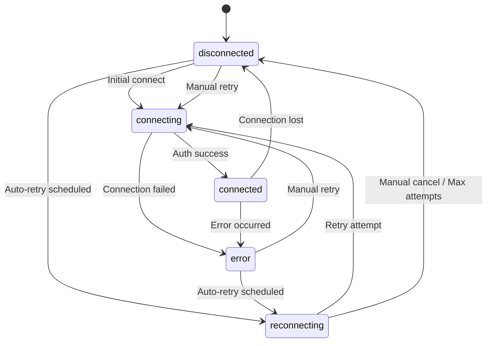

# 🎮 Remote Control Dashboard - Connection State Management Guide

## 📋 Overview

This document explains the enhanced connection state management system for the web-based Android Remote Control dashboard. The implementation provides a robust, user-friendly experience for managing WebSocket connections with automatic reconnection, clear visual feedback, and proper error handling.

---

## 🏗️ Architecture

### Component Structure

```
┌─────────────────────────────────────────────────────────────┐
│                  Remote Control Viewer UI                    │
│  ┌──────────────────────────────────────────────────────┐  │
│  │              RemoteControlViewer                     │  │
│  │  (Main controller - handles UI and WebSocket)        │  │
│  └───────────────────┬──────────────────────────────────┘  │
│                      │                                       │
│  ┌───────────────────▼──────────────────────────────────┐  │
│  │         ConnectionStateManager                       │  │
│  │  (State machine for connection lifecycle)            │  │
│  │  - States: connected, disconnected, reconnecting     │  │
│  │  - Auto-retry with exponential backoff               │  │
│  │  - Countdown timers for user feedback                │  │
│  └──────────────────────────────────────────────────────┘  │
│                                                              │
│  ┌──────────────────────────────────────────────────────┐  │
│  │              WebSocket Connection                    │  │
│  │  (Communicates with relay server)                    │  │
│  └──────────────────────────────────────────────────────┘  │
└─────────────────────────────────────────────────────────────┘
```

---

## 📊 Connection States

### State Definitions

| State | Description | UI Behavior | User Actions |
|-------|-------------|-------------|--------------|
| **disconnected** | No active connection | Shows disconnected overlay with error message | Manual retry available |
| **connecting** | Initial connection attempt | Shows loading spinner | None (automatic) |
| **connected** | Active, authenticated connection | Full functionality enabled | All controls active |
| **reconnecting** | Attempting automatic reconnection | Shows reconnecting overlay with countdown | Cancel reconnection |
| **error** | Connection failed with error | Shows error overlay with specific message | Manual retry available |

### State Transitions



---

## 🔄 Auto-Reconnection Logic

### Configuration

```javascript
const connectionManager = new ConnectionStateManager({
    maxReconnectAttempts: 5,           // Maximum retry attempts
    reconnectDelayMs: 3000,            // Initial delay (3 seconds)
    reconnectBackoffMultiplier: 1.5,   // Exponential backoff factor
    maxReconnectDelayMs: 30000,        // Maximum delay (30 seconds)
    autoReconnect: true                // Enable auto-reconnect
});
```

### Reconnection Schedule

| Attempt | Delay | Cumulative Wait |
|---------|-------|-----------------|
| 1 | 3s | 3s |
| 2 | 4.5s | 7.5s |
| 3 | 6.75s | 14.25s |
| 4 | 10.125s | 24.375s |
| 5 | 15.1875s | 39.5625s |

### Behavior

- **Automatic**: Triggered on disconnection or error (if `autoReconnect` is true)
- **Exponential Backoff**: Each retry waits longer to avoid overwhelming the server
- **Max Attempts**: Stops after 5 failed attempts (configurable)
- **User Feedback**: Countdown timer shows seconds until next attempt
- **Cancellable**: User can cancel auto-reconnection at any time

---

## 🎨 UI/UX Implementation

### Visual States

#### 1. **Connecting State**
```html
<!-- Shows loading spinner -->
<div id="loading-overlay">
    <div class="spinner"></div>
    <p>Connecting to device...</p>
</div>
```

#### 2. **Connected State**
- All overlays hidden
- Canvas fully interactive
- Controls enabled
- Green status indicator

#### 3. **Disconnected State**
```html
<!-- Shows error information and retry button -->
<div id="disconnected-overlay">
    <div class="overlay-icon">⚠️</div>
    <h2>Device Disconnected</h2>
    <p id="error-message">Connection lost</p>
    <button id="btn-retry">🔄 Retry Connection</button>
</div>
```

#### 4. **Reconnecting State**
```html
<!-- Shows countdown and attempt info -->
<div id="reconnecting-overlay">
    <div class="spinner"></div>
    <h2>Reconnecting...</h2>
    <p>Retrying in <span id="reconnect-countdown">5</span> seconds</p>
    <p id="reconnect-attempt">Attempt 1/5</p>
    <button id="btn-cancel-reconnect">Cancel</button>
</div>
```

### Error Messages

The system provides specific error messages based on failure type:

| Error Type | Message | User Action |
|------------|---------|-------------|
| `auth_failed` | "Authentication failed - Invalid credentials" | Check credentials |
| `device_offline` | "Device is offline or unavailable" | Check device status |
| `timeout` | "Connection timeout - No response from device" | Retry connection |
| `network_error` | "Network error - Check your connection" | Check network |
| `unknown` | Custom error message from server | Review logs |

### Control States

When **not connected**, the following controls are disabled:

- ✅ Canvas touch/click (no input sent)
- ✅ Back button (disabled, grayed out)
- ✅ Home button (disabled, grayed out)
- ✅ Keyboard button (disabled, grayed out)
- ✅ Record button (disabled, grayed out)

When **connected**, all controls are enabled and fully functional.

---

## 💻 Code Implementation

### 1. Initialize Connection Manager

```javascript
class RemoteControlViewer {
    constructor(config) {
        // Create connection state manager
        this.connectionManager = new ConnectionStateManager({
            maxReconnectAttempts: 5,
            reconnectDelayMs: 3000,
            autoReconnect: true,
            
            // Callbacks
            onStateChange: (state, error) => this.onConnectionStateChange(state, error),
            onReconnectCountdown: (seconds) => this.onReconnectCountdown(seconds),
            onReconnectAttempt: (attempt) => this.attemptConnection(),
            onMaxReconnectAttemptsReached: () => this.onMaxReconnectAttemptsReached()
        });
    }
}
```

### 2. Handle State Changes

```javascript
onConnectionStateChange(state, error) {
    console.log(`Connection state: ${state}`, error);
    
    // Update UI
    this.updateUIForState(state, error);
    
    // Update control states (enable/disable buttons)
    this.updateControlsState(state);
}
```

### 3. Update UI for Each State

```javascript
updateUIForState(state, error = null) {
    // Hide all overlays first
    this.elements.loadingOverlay?.classList.add('hidden');
    this.elements.disconnectedOverlay?.classList.add('hidden');
    this.elements.reconnectingOverlay?.classList.add('hidden');
    
    switch (state) {
        case ConnectionStateManager.States.CONNECTING:
            this.elements.loadingOverlay?.classList.remove('hidden');
            this.updateConnectionStatus('Connecting...');
            break;
        
        case ConnectionStateManager.States.CONNECTED:
            this.updateConnectionStatus('Connected');
            break;
        
        case ConnectionStateManager.States.RECONNECTING:
            this.elements.reconnectingOverlay?.classList.remove('hidden');
            const status = this.connectionManager.getReconnectStatus();
            this.elements.reconnectAttempt.textContent = 
                `Attempt ${status.attempt}/${status.maxAttempts}`;
            break;
        
        case ConnectionStateManager.States.DISCONNECTED:
        case ConnectionStateManager.States.ERROR:
            this.elements.disconnectedOverlay?.classList.remove('hidden');
            this.elements.errorMessage.textContent = 
                this.connectionManager.getErrorMessage();
            break;
    }
}
```

### 4. Disable/Enable Controls

```javascript
updateControlsState(state) {
    const isConnected = state === ConnectionStateManager.States.CONNECTED;
    
    // Disable/enable buttons
    const buttons = [
        this.elements.btnBack,
        this.elements.btnHome,
        this.elements.btnKeyboard,
        this.elements.btnRecord
    ];
    
    buttons.forEach(btn => {
        if (btn) {
            btn.disabled = !isConnected;
            btn.style.opacity = isConnected ? '1' : '0.5';
            btn.style.cursor = isConnected ? 'pointer' : 'not-allowed';
        }
    });
    
    // Update canvas
    this.canvas.style.cursor = isConnected ? 'crosshair' : 'not-allowed';
    this.canvas.style.opacity = isConnected ? '1' : '0.7';
}
```

### 5. Check Connection State Before Sending Commands

```javascript
handleMouseDown(e) {
    // Check if connected before processing input
    if (!this.connectionManager.canSendCommands()) {
        return; // Ignore if not connected
    }
    
    // Process touch input...
}

sendKeyPress(keyCode) {
    if (!this.connectionManager.canSendCommands()) {
        return; // Ignore if not connected
    }
    
    // Send key command...
}
```

### 6. Manual Reconnection

```javascript
manualReconnect() {
    console.log('Manual reconnection requested');
    
    // Reset connection manager state
    this.connectionManager.manualReconnect();
    
    // Initiate connection
    this.connect();
}

cancelReconnect() {
    console.log('Reconnection cancelled');
    
    // Stop auto-reconnection
    this.connectionManager.manualDisconnect();
    
    // Update UI
    this.updateUIForState(ConnectionStateManager.States.DISCONNECTED);
}
```

---

## 🔍 Error Handling

### WebSocket Errors

```javascript
onError(error) {
    console.error('WebSocket error:', error);
    
    // Notify connection manager
    this.connectionManager.handleError(
        ConnectionStateManager.ErrorTypes.NETWORK_ERROR,
        'WebSocket connection error'
    );
}
```

### Authentication Failures

```javascript
handleMessage(message) {
    if (message.type === 'auth_failed') {
        // Stop auto-reconnect on auth failure
        this.connectionManager.handleError(
            ConnectionStateManager.ErrorTypes.AUTH_FAILED,
            message.reason || 'Authentication failed'
        );
        
        // Close connection
        setTimeout(() => this.disconnect(), 2000);
    }
}
```

### Frame Timeout

```javascript
startFrameTimeoutDetection() {
    this.frameTimeoutHandle = setTimeout(() => {
        console.warn('No frames received from device');
        
        // Trigger reconnection
        this.connectionManager.handleError(
            ConnectionStateManager.ErrorTypes.TIMEOUT,
            'No video frames received from device'
        );
    }, 30000); // 30 seconds
}
```

---

## 🎯 Best Practices

### 1. **Always Check Connection State**
```javascript
// ✅ Good
if (this.connectionManager.canSendCommands()) {
    this.sendTouch(x, y);
}

// ❌ Bad
this.sendTouch(x, y); // May fail if disconnected
```

### 2. **Provide Clear Error Messages**
```javascript
// ✅ Good
this.connectionManager.handleError(
    ConnectionStateManager.ErrorTypes.DEVICE_OFFLINE,
    'Device disconnected from relay server'
);

// ❌ Bad
this.connectionManager.handleError(
    ConnectionStateManager.ErrorTypes.UNKNOWN,
    'Error' // Too vague
);
```

### 3. **Handle Cleanup Properly**
```javascript
destroy() {
    // Clean up WebSocket
    this.disconnect();
    
    // Clean up connection manager
    this.connectionManager.destroy();
    
    // Clear timers
    if (this.frameTimeoutHandle) {
        clearTimeout(this.frameTimeoutHandle);
    }
}
```

### 4. **Update Status Dot Visual**
```javascript
// Update status indicator based on state
const statusDot = document.querySelector('.status-dot');
statusDot.className = `status-dot ${state}`;
```

---

## 🧪 Testing Scenarios

### Test Case 1: Normal Connection
1. Open viewer page
2. **Expected**: Loading overlay appears
3. WebSocket connects successfully
4. **Expected**: Loading overlay disappears, video stream appears
5. **Result**: ✅ All controls enabled

### Test Case 2: Connection Loss
1. Connected state
2. Disconnect device or relay server
3. **Expected**: Reconnecting overlay appears with countdown
4. After 5 failed attempts
5. **Expected**: Disconnected overlay with "Retry" button

### Test Case 3: Manual Reconnection
1. In disconnected state
2. Click "Retry Connection" button
3. **Expected**: Connecting overlay appears
4. Connection succeeds
5. **Expected**: Return to connected state

### Test Case 4: Cancel Auto-Reconnect
1. In reconnecting state with countdown
2. Click "Cancel" button
3. **Expected**: Auto-reconnect stops
4. **Expected**: Disconnected overlay appears

### Test Case 5: Authentication Failure
1. Use invalid credentials
2. Connect to relay server
3. **Expected**: Error overlay with "Authentication failed" message
4. **Expected**: No auto-reconnect (auth errors should not retry automatically)

---

## 📦 File Structure

```
cosmic-media-streaming-dpr/
├── public/
│   └── js/
│       ├── connection-state-manager.js  # State machine
│       └── remote-control-viewer.js     # Main viewer class
└── resources/
    └── views/
        └── remote-control-viewer-enhanced.blade.php  # UI template
```

---

## 🚀 Usage Example

### Backend Controller (Laravel)

```php
public function show($deviceId)
{
    $device = Remote::findOrFail($deviceId);
    
    return view('remote-control-viewer-enhanced', [
        'deviceId' => $device->id,
        'deviceName' => $device->name,
        'deviceToken' => $device->token,
        'wsUrl' => config('app.relay_server_url'),
        'userId' => auth()->id(),
        'userName' => auth()->user()->name,
        'sessionToken' => session()->token(),
        'canControl' => auth()->user()->can('control-device'),
        'canRecord' => auth()->user()->can('record-session'),
    ]);
}
```

### Frontend Configuration

```javascript
window.remoteControlConfig = {
    wsUrl: 'wss://kiosk.example.com/remote-control-ws',
    deviceId: 74,
    deviceToken: 'xxx',
    deviceName: 'Samsung SM-A525F',
    userId: 1,
    userName: 'Admin',
    sessionToken: 'session_token',
    canControl: true,
    canRecord: false,
    maxReconnectAttempts: 5,
    reconnectDelayMs: 3000,
    autoReconnect: true
};
```

---

## 🔧 Configuration Options

### ConnectionStateManager Options

| Option | Type | Default | Description |
|--------|------|---------|-------------|
| `maxReconnectAttempts` | number | 5 | Maximum reconnection attempts |
| `reconnectDelayMs` | number | 3000 | Initial reconnection delay (ms) |
| `reconnectBackoffMultiplier` | number | 1.5 | Exponential backoff multiplier |
| `maxReconnectDelayMs` | number | 30000 | Maximum reconnection delay (ms) |
| `autoReconnect` | boolean | true | Enable automatic reconnection |

### RemoteControlViewer Options

| Option | Type | Default | Description |
|--------|------|---------|-------------|
| `wsUrl` | string | required | WebSocket relay server URL |
| `deviceId` | number | required | Target device ID |
| `deviceToken` | string | required | Device authentication token |
| `sessionToken` | string | required | Viewer session token |
| `canControl` | boolean | true | Allow sending control commands |
| `canRecord` | boolean | false | Enable session recording |

---

## 📝 Summary

This implementation provides:

✅ **Robust State Management** - Clear state machine with well-defined transitions  
✅ **Auto-Reconnection** - Exponential backoff with user feedback  
✅ **Error Handling** - Specific error types with appropriate messages  
✅ **User Control** - Manual retry and cancel options  
✅ **Visual Feedback** - Distinct overlays for each state  
✅ **Control Disabling** - Prevents invalid actions when disconnected  
✅ **Dark Mode Friendly** - Professional, modern UI design  
✅ **Production Ready** - Clean, maintainable, and well-documented code  

---

**Version**: 2.0.0  
**Last Updated**: February 4, 2026  
**Author**: Cosmic Development Team
