# Mermaid Diagrams - Cosmic Media Streaming Platform

Dokumentasi ini berisi semua diagram arsitektur dalam format Mermaid yang dapat digunakan di GitHub, GitLab, atau tools yang mendukung Mermaid.

**🎯 Status Verifikasi:** ✅ VERIFIED - Sesuai dengan implementasi aktual (22 Jan 2026)

**Implementasi Services:**
- ✅ **cosmic-media-streaming-dpr** → Laravel CMS (Port 80) + MariaDB + Redis + MinIO
- ✅ **generate-pdf** → Node.js/Puppeteer (Port 3333) untuk report generation
- ✅ **remote-android-device** → Python FastAPI (Port 3001) untuk device monitoring
- ✅ **kiosk-touchscreen-dpr-app** → Android APK WebView client

**Infrastruktur:**
- Network: **kiosk-net** (external, 172.28.0.0/16)
- Database: MariaDB 10.11 (bind mount: `./docker-data/mariadb`)
- Cache: Redis 7-alpine (bind mount: `./docker-data/redis`)
- Storage: MinIO (bind mount: `./docker-data/minio`)
- Deploy: Zero-downtime dengan `deploy.sh` (git pull + docker compose up)

---

## 1. Arsitektur High-Level

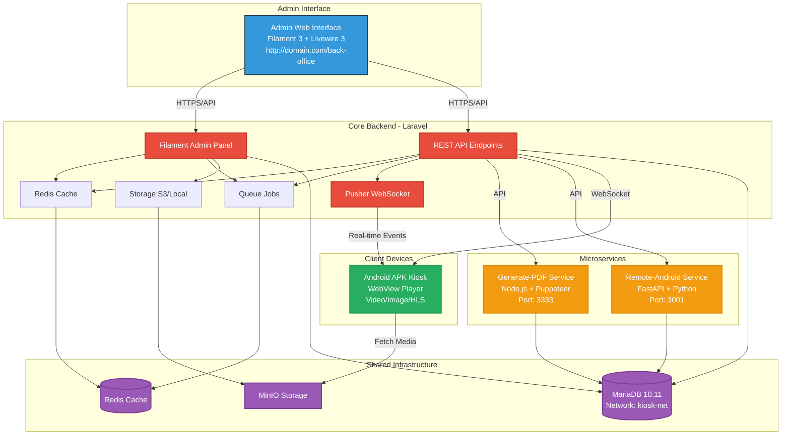
```mermaid
graph TB
    subgraph "Admin Interface"
        A[Admin Web Interface<br/>Filament 3 + Livewire 3<br/>http://domain.com/back-office]
    end
    
    subgraph "Core Backend - Laravel"
        B[Filament Admin Panel]
        C[REST API Endpoints]
        D[Pusher WebSocket]
        E[Redis Cache]
        F[Queue Jobs]
        G[Storage S3/Local]
    end
    
    subgraph "Microservices"
        H[Generate-PDF Service<br/>Node.js + Puppeteer<br/>Port: 3333]
        I[Remote-Android Service<br/>FastAPI + Python<br/>Port: 3001]
    end
    
    subgraph "Client Devices"
        J[Android APK Kiosk<br/>WebView Player<br/>Video/Image/HLS]
    end
    
    subgraph "Shared Infrastructure"
        K[(MariaDB 10.11<br/>Network: kiosk-net)]
        L[(Redis Cache)]
        M[MinIO Storage]
    end
    
    A -->|HTTPS/API| B
    A -->|HTTPS/API| C
    B --> E
    B --> F
    B --> G
    C --> E
    C --> F
    C --> D
    
    C -->|API| H
    C -->|API| I
    C -->|WebSocket| J
    D -->|Real-time Events| J
    
    B --> K
    C --> K
    H --> K
    I --> K
    
    E --> L
    F --> L
    
    G --> M
    J -->|Fetch Media| M
    
    style A fill:#3498db,stroke:#2c3e50,stroke-width:2px,color:#fff
    style B fill:#e74c3c,stroke:#c0392b,stroke-width:2px,color:#fff
    style C fill:#e74c3c,stroke:#c0392b,stroke-width:2px,color:#fff
    style D fill:#e74c3c,stroke:#c0392b,stroke-width:2px,color:#fff
    style H fill:#f39c12,stroke:#d68910,stroke-width:2px,color:#fff
    style I fill:#f39c12,stroke:#d68910,stroke-width:2px,color:#fff
    style J fill:#27ae60,stroke:#229954,stroke-width:2px,color:#fff
    style K fill:#9b59b6,stroke:#7d3c98,stroke-width:2px,color:#fff
    style L fill:#9b59b6,stroke:#7d3c98,stroke-width:2px,color:#fff
    style M fill:#9b59b6,stroke:#7d3c98,stroke-width:2px,color:#fff
```

---

## 2. Content Update Flow

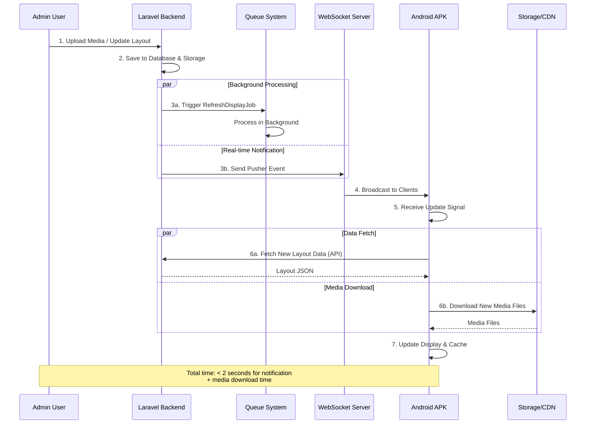
```mermaid
sequenceDiagram
    participant Admin as Admin User
    participant Laravel as Laravel Backend
    participant Queue as Queue System
    participant Pusher as WebSocket Server
    participant APK as Android APK
    participant Storage as Storage/CDN
    
    Admin->>Laravel: 1. Upload Media / Update Layout
    Laravel->>Laravel: 2. Save to Database & Storage
    
    par Background Processing
        Laravel->>Queue: 3a. Trigger RefreshDisplayJob
        Queue->>Queue: Process in Background
    and Real-time Notification
        Laravel->>Pusher: 3b. Send Pusher Event
    end
    
    Pusher->>APK: 4. Broadcast to Clients
    APK->>APK: 5. Receive Update Signal
    
    par Data Fetch
        APK->>Laravel: 6a. Fetch New Layout Data (API)
        Laravel-->>APK: Layout JSON
    and Media Download
        APK->>Storage: 6b. Download New Media Files
        Storage-->>APK: Media Files
    end
    
    APK->>APK: 7. Update Display & Cache
    
    Note over Admin,APK: Total time: < 2 seconds for notification<br/>+ media download time
```

---

## 3. Device Monitoring Flow

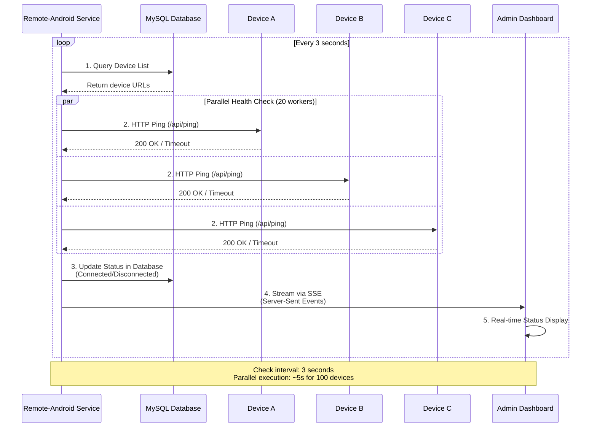
```mermaid
sequenceDiagram
    participant Monitor as Remote-Android Service
    participant DB as MySQL Database
    participant Device1 as Device A
    participant Device2 as Device B
    participant Device3 as Device C
    participant Dashboard as Admin Dashboard
    
    loop Every 3 seconds
        Monitor->>DB: 1. Query Device List
        DB-->>Monitor: Return device URLs
        
        par Parallel Health Check (20 workers)
            Monitor->>Device1: 2. HTTP Ping (/api/ping)
            Device1-->>Monitor: 200 OK / Timeout
        and
            Monitor->>Device2: 2. HTTP Ping (/api/ping)
            Device2-->>Monitor: 200 OK / Timeout
        and
            Monitor->>Device3: 2. HTTP Ping (/api/ping)
            Device3-->>Monitor: 200 OK / Timeout
        end
        
        Monitor->>DB: 3. Update Status in Database<br/>(Connected/Disconnected)
        
        Monitor->>Dashboard: 4. Stream via SSE<br/>(Server-Sent Events)
        Dashboard->>Dashboard: 5. Real-time Status Display
    end
    
    Note over Monitor,Dashboard: Check interval: 3 seconds<br/>Parallel execution: ~5s for 100 devices
```

---

## 4. PDF Generation Flow

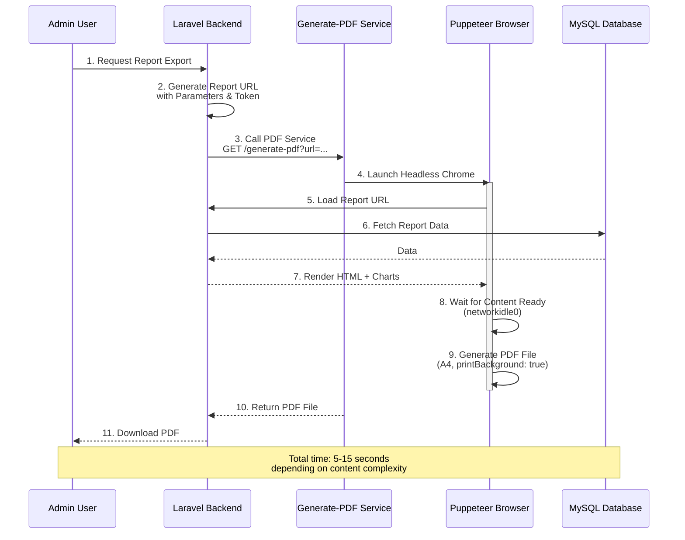
```mermaid
sequenceDiagram
    participant Admin as Admin User
    participant Laravel as Laravel Backend
    participant PDF as Generate-PDF Service
    participant Puppeteer as Puppeteer Browser
    participant DB as MySQL Database
    
    Admin->>Laravel: 1. Request Report Export
    Laravel->>Laravel: 2. Generate Report URL<br/>with Parameters & Token
    
    Laravel->>PDF: 3. Call PDF Service<br/>GET /generate-pdf?url=...
    
    PDF->>Puppeteer: 4. Launch Headless Chrome
    activate Puppeteer
    
    Puppeteer->>Laravel: 5. Load Report URL
    Laravel->>DB: 6. Fetch Report Data
    DB-->>Laravel: Data
    Laravel-->>Puppeteer: 7. Render HTML + Charts
    
    Puppeteer->>Puppeteer: 8. Wait for Content Ready<br/>(networkidle0)
    Puppeteer->>Puppeteer: 9. Generate PDF File<br/>(A4, printBackground: true)
    
    deactivate Puppeteer
    
    PDF-->>Laravel: 10. Return PDF File
    Laravel-->>Admin: 11. Download PDF
    
    Note over Admin,DB: Total time: 5-15 seconds<br/>depending on content complexity
```

---

## 5. Database Schema (Simplified)

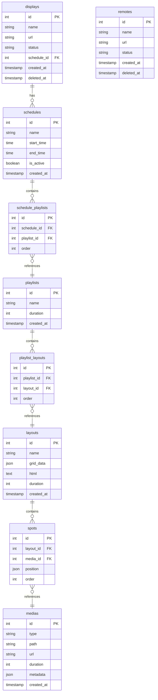
```mermaid
erDiagram
    displays ||--o{ schedules : "has"
    schedules ||--o{ schedule_playlists : "contains"
    schedule_playlists }o--|| playlists : "references"
    playlists ||--o{ playlist_layouts : "contains"
    playlist_layouts }o--|| layouts : "references"
    layouts ||--o{ spots : "contains"
    spots }o--|| medias : "references"
    
    displays {
        int id PK
        string name
        string url
        string status
        int schedule_id FK
        timestamp created_at
        timestamp deleted_at
    }
    
    schedules {
        int id PK
        string name
        time start_time
        time end_time
        boolean is_active
        timestamp created_at
    }
    
    schedule_playlists {
        int id PK
        int schedule_id FK
        int playlist_id FK
        int order
    }
    
    playlists {
        int id PK
        string name
        int duration
        timestamp created_at
    }
    
    playlist_layouts {
        int id PK
        int playlist_id FK
        int layout_id FK
        int order
    }
    
    layouts {
        int id PK
        string name
        json grid_data
        text html
        int duration
        timestamp created_at
    }
    
    spots {
        int id PK
        int layout_id FK
        int media_id FK
        json position
        int order
    }
    
    medias {
        int id PK
        string type
        string path
        string url
        int duration
        json metadata
        timestamp created_at
    }
    
    remotes {
        int id PK
        string name
        string url
        string status
        timestamp created_at
        timestamp deleted_at
    }
```

---

## 6. Scheduling System Flow

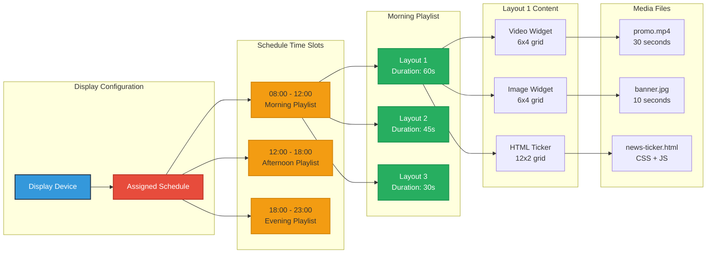
```mermaid
graph LR
    subgraph "Display Configuration"
        A[Display Device] --> B[Assigned Schedule]
    end
    
    subgraph "Schedule Time Slots"
        B --> C[08:00 - 12:00<br/>Morning Playlist]
        B --> D[12:00 - 18:00<br/>Afternoon Playlist]
        B --> E[18:00 - 23:00<br/>Evening Playlist]
    end
    
    subgraph "Morning Playlist"
        C --> F[Layout 1<br/>Duration: 60s]
        C --> G[Layout 2<br/>Duration: 45s]
        C --> H[Layout 3<br/>Duration: 30s]
    end
    
    subgraph "Layout 1 Content"
        F --> I[Video Widget<br/>6x4 grid]
        F --> J[Image Widget<br/>6x4 grid]
        F --> K[HTML Ticker<br/>12x2 grid]
    end
    
    subgraph "Media Files"
        I --> L[promo.mp4<br/>30 seconds]
        J --> M[banner.jpg<br/>10 seconds]
        K --> N[news-ticker.html<br/>CSS + JS]
    end
    
    style A fill:#3498db,stroke:#2c3e50,stroke-width:2px,color:#fff
    style B fill:#e74c3c,stroke:#c0392b,stroke-width:2px,color:#fff
    style C fill:#f39c12,stroke:#d68910,stroke-width:2px
    style D fill:#f39c12,stroke:#d68910,stroke-width:2px
    style E fill:#f39c12,stroke:#d68910,stroke-width:2px
    style F fill:#27ae60,stroke:#229954,stroke-width:2px,color:#fff
    style G fill:#27ae60,stroke:#229954,stroke-width:2px,color:#fff
    style H fill:#27ae60,stroke:#229954,stroke-width:2px,color:#fff
```

---

## 7. Generate-PDF Integration with Core System

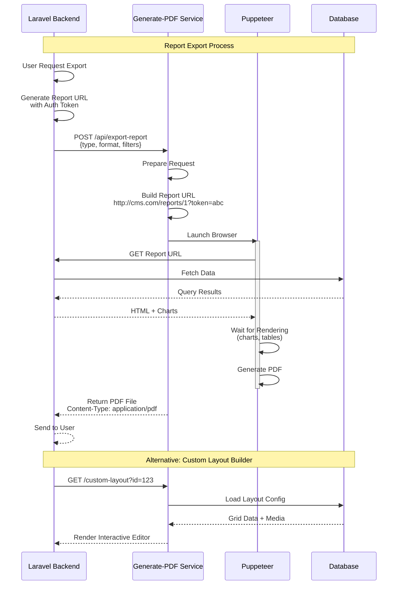
```mermaid
sequenceDiagram
    participant Laravel as Laravel Backend
    participant PDF as Generate-PDF Service
    participant Puppeteer as Puppeteer
    participant DB as Database
    
    Note over Laravel,DB: Report Export Process
    
    Laravel->>Laravel: User Request Export
    Laravel->>Laravel: Generate Report URL<br/>with Auth Token
    
    Laravel->>PDF: POST /api/export-report<br/>{type, format, filters}
    
    PDF->>PDF: Prepare Request
    PDF->>PDF: Build Report URL<br/>http://cms.com/reports/1?token=abc
    
    PDF->>Puppeteer: Launch Browser
    activate Puppeteer
    
    Puppeteer->>Laravel: GET Report URL
    Laravel->>DB: Fetch Data
    DB-->>Laravel: Query Results
    Laravel-->>Puppeteer: HTML + Charts
    
    Puppeteer->>Puppeteer: Wait for Rendering<br/>(charts, tables)
    Puppeteer->>Puppeteer: Generate PDF
    
    deactivate Puppeteer
    
    PDF-->>Laravel: Return PDF File<br/>Content-Type: application/pdf
    Laravel-->>Laravel: Send to User
    
    Note over Laravel,DB: Alternative: Custom Layout Builder
    
    Laravel->>PDF: GET /custom-layout?id=123
    PDF->>DB: Load Layout Config
    DB-->>PDF: Grid Data + Media
    PDF-->>Laravel: Render Interactive Editor
```

---

## 8. Android APK Architecture

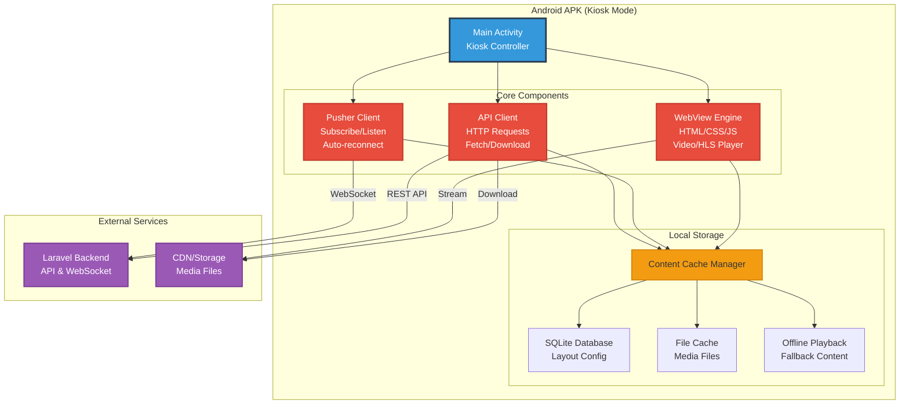
```mermaid
graph TB
    subgraph "Android APK (Kiosk Mode)"
        A[Main Activity<br/>Kiosk Controller]
        
        subgraph "Core Components"
            B[WebView Engine<br/>HTML/CSS/JS<br/>Video/HLS Player]
            C[Pusher Client<br/>Subscribe/Listen<br/>Auto-reconnect]
            D[API Client<br/>HTTP Requests<br/>Fetch/Download]
        end
        
        subgraph "Local Storage"
            E[Content Cache Manager]
            F[SQLite Database<br/>Layout Config]
            G[File Cache<br/>Media Files]
            H[Offline Playback<br/>Fallback Content]
        end
        
        A --> B
        A --> C
        A --> D
        
        B --> E
        C --> E
        D --> E
        
        E --> F
        E --> G
        E --> H
    end
    
    subgraph "External Services"
        I[Laravel Backend<br/>API & WebSocket]
        J[CDN/Storage<br/>Media Files]
    end
    
    D -->|REST API| I
    C -->|WebSocket| I
    D -->|Download| J
    B -->|Stream| J
    
    style A fill:#3498db,stroke:#2c3e50,stroke-width:3px,color:#fff
    style B fill:#e74c3c,stroke:#c0392b,stroke-width:2px,color:#fff
    style C fill:#e74c3c,stroke:#c0392b,stroke-width:2px,color:#fff
    style D fill:#e74c3c,stroke:#c0392b,stroke-width:2px,color:#fff
    style E fill:#f39c12,stroke:#d68910,stroke-width:2px
    style I fill:#9b59b6,stroke:#7d3c98,stroke-width:2px,color:#fff
    style J fill:#9b59b6,stroke:#7d3c98,stroke-width:2px,color:#fff
```

---

## 9. Complete System Sequence Diagram

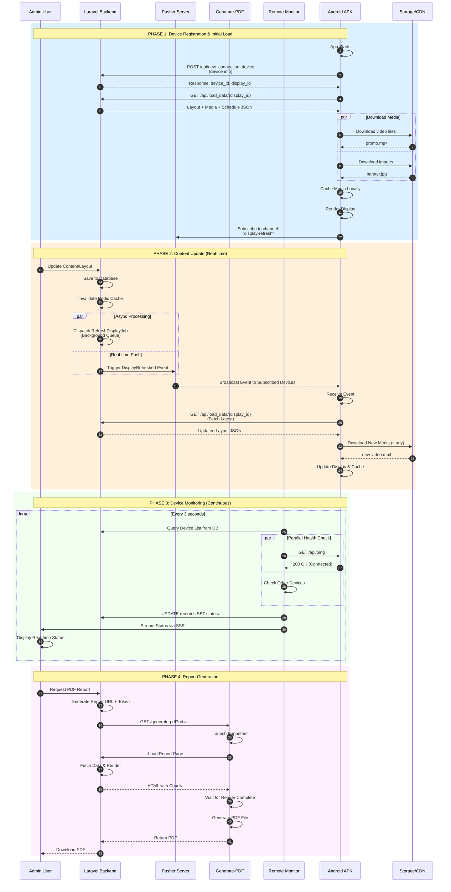
```mermaid
sequenceDiagram
    autonumber
    participant Admin as Admin User
    participant Laravel as Laravel Backend
    participant Pusher as Pusher Server
    participant PDF as Generate-PDF
    participant Monitor as Remote Monitor
    participant APK as Android APK
    participant Storage as Storage/CDN
    
    rect rgb(220, 240, 255)
        Note over Admin,APK: PHASE 1: Device Registration & Initial Load
        
        APK->>APK: App Starts
        APK->>Laravel: POST /api/new_connection_device<br/>(device info)
        Laravel-->>APK: Response: device_id, display_id
        
        APK->>Laravel: GET /api/load_data/{display_id}
        Laravel-->>APK: Layout + Media + Schedule JSON
        
        par Download Media
            APK->>Storage: Download video files
            Storage-->>APK: promo.mp4
        and
            APK->>Storage: Download images
            Storage-->>APK: banner.jpg
        end
        
        APK->>APK: Cache Media Locally
        APK->>APK: Render Display
        APK->>Pusher: Subscribe to channel:<br/>"display-refresh"
    end
    
    rect rgb(255, 240, 220)
        Note over Admin,APK: PHASE 2: Content Update (Real-time)
        
        Admin->>Laravel: Update Content/Layout
        Laravel->>Laravel: Save to Database
        Laravel->>Laravel: Invalidate Redis Cache
        
        par Async Processing
            Laravel->>Laravel: Dispatch RefreshDisplayJob<br/>(Background Queue)
        and Real-time Push
            Laravel->>Pusher: Trigger DisplayRefreshed Event
        end
        
        Pusher-->>APK: Broadcast Event to Subscribed Devices
        APK->>APK: Receive Event
        
        APK->>Laravel: GET /api/load_data/{display_id}<br/>(Fetch Latest)
        Laravel-->>APK: Updated Layout JSON
        
        APK->>Storage: Download New Media (if any)
        Storage-->>APK: new-video.mp4
        
        APK->>APK: Update Display & Cache
    end
    
    rect rgb(240, 255, 240)
        Note over Admin,APK: PHASE 3: Device Monitoring (Continuous)
        
        loop Every 3 seconds
            Monitor->>Laravel: Query Device List from DB
            
            par Parallel Health Check
                Monitor->>APK: GET /api/ping
                APK-->>Monitor: 200 OK (Connected)
            and
                Monitor->>Monitor: Check Other Devices
            end
            
            Monitor->>Laravel: UPDATE remotes SET status=...
            Monitor->>Admin: Stream Status via SSE
            Admin->>Admin: Display Real-time Status
        end
    end
    
    rect rgb(255, 240, 255)
        Note over Admin,APK: PHASE 4: Report Generation
        
        Admin->>Laravel: Request PDF Report
        Laravel->>Laravel: Generate Report URL + Token
        
        Laravel->>PDF: GET /generate-pdf?url=...
        PDF->>PDF: Launch Puppeteer
        PDF->>Laravel: Load Report Page
        Laravel->>Laravel: Fetch Data & Render
        Laravel-->>PDF: HTML with Charts
        PDF->>PDF: Wait for Render Complete
        PDF->>PDF: Generate PDF File
        PDF-->>Laravel: Return PDF
        Laravel-->>Admin: Download PDF
    end
```

---

## 10. Production Network Topology

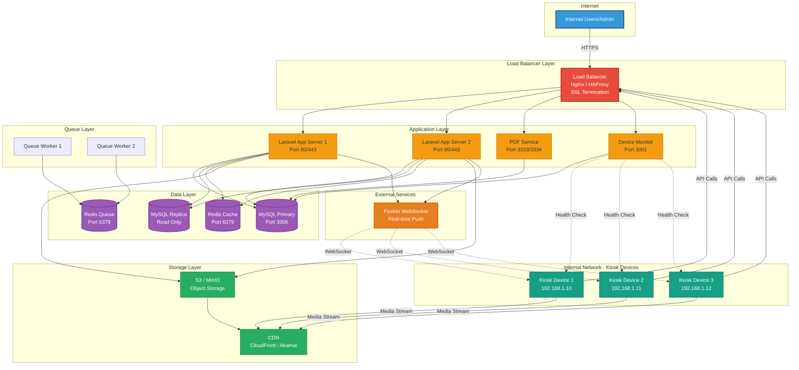
```mermaid
graph TB
    subgraph Internet
        A[Internet Users/Admin]
    end
    
    subgraph "Load Balancer Layer"
        B[Load Balancer<br/>Nginx / HAProxy<br/>SSL Termination]
    end
    
    subgraph "Application Layer"
        C[Laravel App Server 1<br/>Port 80/443]
        D[Laravel App Server 2<br/>Port 80/443]
        E[PDF Service<br/>Port 3333/3334]
        F[Device Monitor<br/>Port 3001]
    end
    
    subgraph "Queue Layer"
        G[Queue Worker 1]
        H[Queue Worker 2]
    end
    
    subgraph "Data Layer"
        I[(MySQL Primary<br/>Port 3306)]
        J[(MySQL Replica<br/>Read Only)]
        K[(Redis Cache<br/>Port 6379)]
        L[(Redis Queue<br/>Port 6379)]
    end
    
    subgraph "Storage Layer"
        M[S3 / MinIO<br/>Object Storage]
        N[CDN<br/>CloudFront / Akamai]
    end
    
    subgraph "External Services"
        O[Pusher WebSocket<br/>Real-time Push]
    end
    
    subgraph "Internal Network - Kiosk Devices"
        P[Kiosk Device 1<br/>192.168.1.10]
        Q[Kiosk Device 2<br/>192.168.1.11]
        R[Kiosk Device 3<br/>192.168.1.12]
    end
    
    A -->|HTTPS| B
    
    B --> C
    B --> D
    B --> E
    B --> F
    
    C --> I
    D --> I
    E --> I
    F --> I
    
    C --> J
    D --> J
    
    C --> K
    D --> K
    
    G --> L
    H --> L
    
    C --> M
    D --> M
    M --> N
    
    C --> O
    D --> O
    
    O -.->|WebSocket| P
    O -.->|WebSocket| Q
    O -.->|WebSocket| R
    
    P -->|API Calls| B
    Q -->|API Calls| B
    R -->|API Calls| B
    
    P -->|Media Stream| N
    Q -->|Media Stream| N
    R -->|Media Stream| N
    
    F -.->|Health Check| P
    F -.->|Health Check| Q
    F -.->|Health Check| R
    
    style A fill:#3498db,stroke:#2c3e50,stroke-width:2px,color:#fff
    style B fill:#e74c3c,stroke:#c0392b,stroke-width:3px,color:#fff
    style C fill:#f39c12,stroke:#d68910,stroke-width:2px
    style D fill:#f39c12,stroke:#d68910,stroke-width:2px
    style E fill:#f39c12,stroke:#d68910,stroke-width:2px
    style F fill:#f39c12,stroke:#d68910,stroke-width:2px
    style I fill:#9b59b6,stroke:#7d3c98,stroke-width:2px,color:#fff
    style J fill:#9b59b6,stroke:#7d3c98,stroke-width:2px,color:#fff
    style K fill:#9b59b6,stroke:#7d3c98,stroke-width:2px,color:#fff
    style L fill:#9b59b6,stroke:#7d3c98,stroke-width:2px,color:#fff
    style M fill:#27ae60,stroke:#229954,stroke-width:2px,color:#fff
    style N fill:#27ae60,stroke:#229954,stroke-width:2px,color:#fff
    style O fill:#e67e22,stroke:#d35400,stroke-width:2px,color:#fff
    style P fill:#16a085,stroke:#138d75,stroke-width:2px,color:#fff
    style Q fill:#16a085,stroke:#138d75,stroke-width:2px,color:#fff
    style R fill:#16a085,stroke:#138d75,stroke-width:2px,color:#fff
```

---

## 11. Data Flow - Layout Rendering

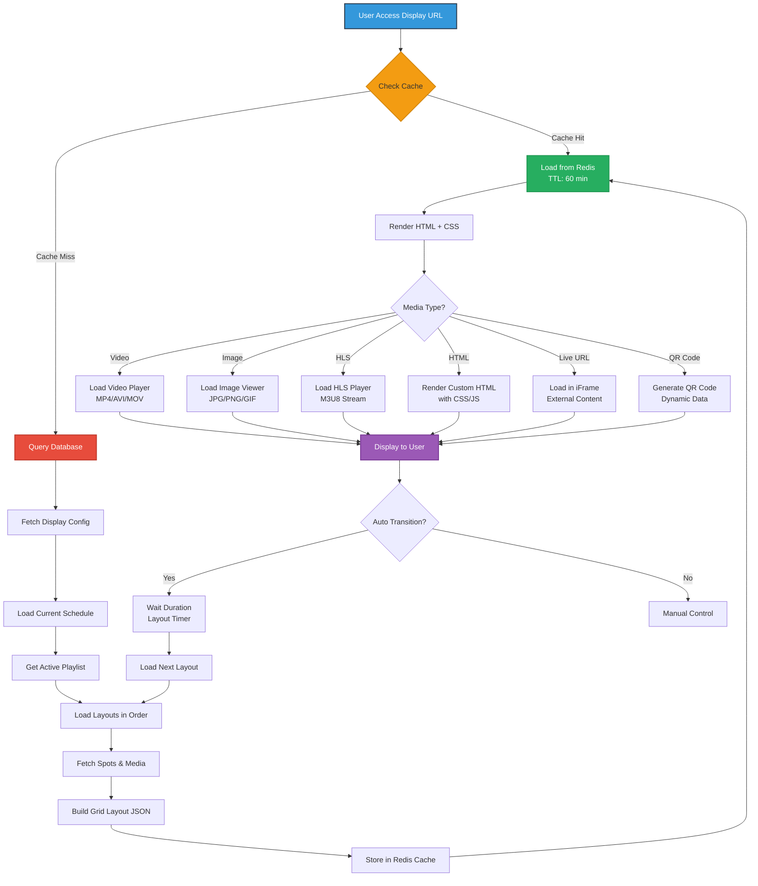
```mermaid
flowchart TD
    A[User Access Display URL] --> B{Check Cache}
    
    B -->|Cache Hit| C[Load from Redis<br/>TTL: 60 min]
    B -->|Cache Miss| D[Query Database]
    
    D --> E[Fetch Display Config]
    E --> F[Load Current Schedule]
    F --> G[Get Active Playlist]
    G --> H[Load Layouts in Order]
    H --> I[Fetch Spots & Media]
    
    I --> J[Build Grid Layout JSON]
    J --> K[Store in Redis Cache]
    K --> C
    
    C --> L[Render HTML + CSS]
    L --> M{Media Type?}
    
    M -->|Video| N[Load Video Player<br/>MP4/AVI/MOV]
    M -->|Image| O[Load Image Viewer<br/>JPG/PNG/GIF]
    M -->|HLS| P[Load HLS Player<br/>M3U8 Stream]
    M -->|HTML| Q[Render Custom HTML<br/>with CSS/JS]
    M -->|Live URL| R[Load in iFrame<br/>External Content]
    M -->|QR Code| S[Generate QR Code<br/>Dynamic Data]
    
    N --> T[Display to User]
    O --> T
    P --> T
    Q --> T
    R --> T
    S --> T
    
    T --> U{Auto Transition?}
    U -->|Yes| V[Wait Duration<br/>Layout Timer]
    V --> W[Load Next Layout]
    W --> H
    
    U -->|No| X[Manual Control]
    
    style A fill:#3498db,stroke:#2c3e50,stroke-width:2px,color:#fff
    style B fill:#f39c12,stroke:#d68910,stroke-width:2px
    style C fill:#27ae60,stroke:#229954,stroke-width:2px,color:#fff
    style D fill:#e74c3c,stroke:#c0392b,stroke-width:2px,color:#fff
    style T fill:#9b59b6,stroke:#7d3c98,stroke-width:2px,color:#fff
```

---

## 12. Queue Job Processing Flow

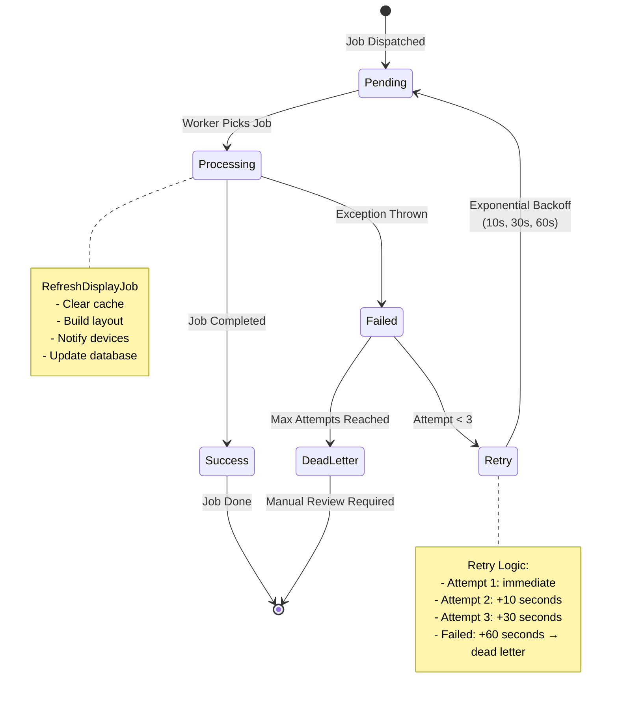
```mermaid
stateDiagram-v2
    [*] --> Pending: Job Dispatched
    
    Pending --> Processing: Worker Picks Job
    
    Processing --> Success: Job Completed
    Processing --> Failed: Exception Thrown
    
    Failed --> Retry: Attempt < 3
    Failed --> DeadLetter: Max Attempts Reached
    
    Retry --> Pending: Exponential Backoff<br/>(10s, 30s, 60s)
    
    Success --> [*]: Job Done
    DeadLetter --> [*]: Manual Review Required
    
    note right of Processing
        RefreshDisplayJob
        - Clear cache
        - Build layout
        - Notify devices
        - Update database
    end note
    
    note right of Retry
        Retry Logic:
        - Attempt 1: immediate
        - Attempt 2: +10 seconds
        - Attempt 3: +30 seconds
        - Failed: +60 seconds → dead letter
    end note
```

---

## 13. Real-time Event Broadcasting

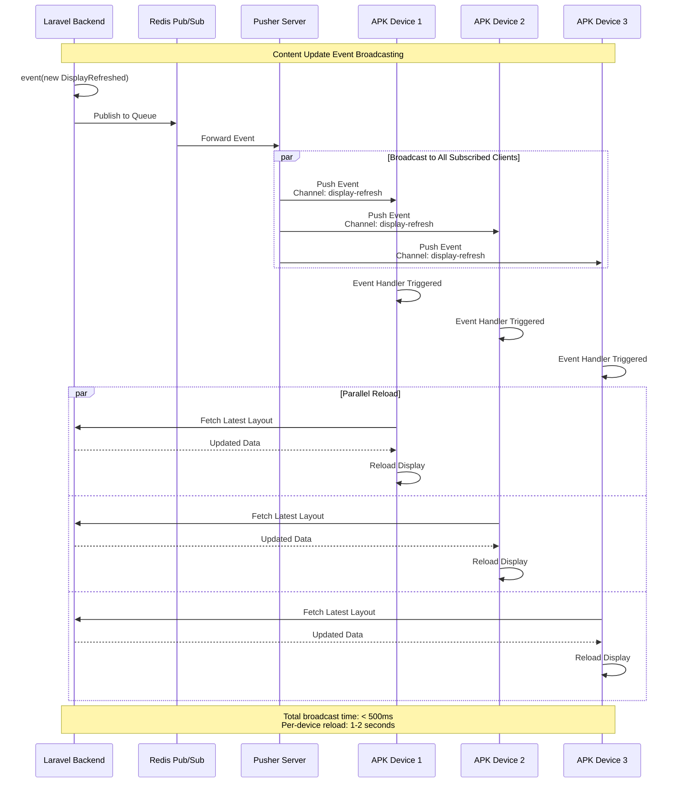
```mermaid
sequenceDiagram
    participant Backend as Laravel Backend
    participant Redis as Redis Pub/Sub
    participant Pusher as Pusher Server
    participant Device1 as APK Device 1
    participant Device2 as APK Device 2
    participant Device3 as APK Device 3
    
    Note over Backend,Device3: Content Update Event Broadcasting
    
    Backend->>Backend: event(new DisplayRefreshed)
    Backend->>Redis: Publish to Queue
    
    Redis->>Pusher: Forward Event
    
    par Broadcast to All Subscribed Clients
        Pusher->>Device1: Push Event<br/>Channel: display-refresh
        Pusher->>Device2: Push Event<br/>Channel: display-refresh
        Pusher->>Device3: Push Event<br/>Channel: display-refresh
    end
    
    Device1->>Device1: Event Handler Triggered
    Device2->>Device2: Event Handler Triggered
    Device3->>Device3: Event Handler Triggered
    
    par Parallel Reload
        Device1->>Backend: Fetch Latest Layout
        Backend-->>Device1: Updated Data
        Device1->>Device1: Reload Display
    and
        Device2->>Backend: Fetch Latest Layout
        Backend-->>Device2: Updated Data
        Device2->>Device2: Reload Display
    and
        Device3->>Backend: Fetch Latest Layout
        Backend-->>Device3: Updated Data
        Device3->>Device3: Reload Display
    end
    
    Note over Backend,Device3: Total broadcast time: < 500ms<br/>Per-device reload: 1-2 seconds
```

---

## 14. Cache Invalidation Strategy

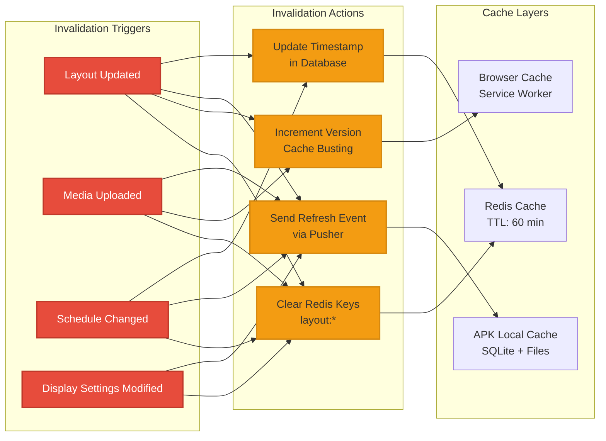
```mermaid
graph LR
    subgraph "Cache Layers"
        A[Redis Cache<br/>TTL: 60 min]
        B[Browser Cache<br/>Service Worker]
        C[APK Local Cache<br/>SQLite + Files]
    end
    
    subgraph "Invalidation Triggers"
        D[Layout Updated]
        E[Media Uploaded]
        F[Schedule Changed]
        G[Display Settings Modified]
    end
    
    subgraph "Invalidation Actions"
        H[Clear Redis Keys<br/>layout:*]
        I[Increment Version<br/>Cache Busting]
        J[Send Refresh Event<br/>via Pusher]
        K[Update Timestamp<br/>in Database]
    end
    
    D --> H
    D --> I
    D --> J
    D --> K
    
    E --> H
    E --> I
    E --> J
    
    F --> H
    F --> J
    F --> K
    
    G --> H
    G --> J
    
    H --> A
    I --> B
    J --> C
    K --> A
    
    style D fill:#e74c3c,stroke:#c0392b,stroke-width:2px,color:#fff
    style E fill:#e74c3c,stroke:#c0392b,stroke-width:2px,color:#fff
    style F fill:#e74c3c,stroke:#c0392b,stroke-width:2px,color:#fff
    style G fill:#e74c3c,stroke:#c0392b,stroke-width:2px,color:#fff
    style H fill:#f39c12,stroke:#d68910,stroke-width:2px
    style I fill:#f39c12,stroke:#d68910,stroke-width:2px
    style J fill:#f39c12,stroke:#d68910,stroke-width:2px
    style K fill:#f39c12,stroke:#d68910,stroke-width:2px
```

---

## Cara Menggunakan Diagram Mermaid

### 1. GitHub / GitLab
Langsung paste code mermaid di dalam file markdown:

````markdown
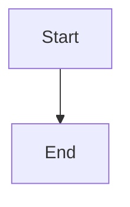
```mermaid
graph TB
    A[Start] --> B[End]
```
````

### 2. Mermaid Live Editor
Buka https://mermaid.live dan paste code untuk edit/export

### 3. VS Code
Install extension: **Markdown Preview Mermaid Support**

### 4. Export ke PNG/SVG
Gunakan Mermaid CLI:
```bash
npm install -g @mermaid-js/mermaid-cli
mmdc -i diagram.mmd -o diagram.png
```

### 5. Integrate di Website
```html
<script type="module">
  import mermaid from 'https://cdn.jsdelivr.net/npm/mermaid@10/dist/mermaid.esm.min.mjs';
  mermaid.initialize({ startOnLoad: true });
</script>

<div class="mermaid">
  graph TB
    A[Start] --> B[End]
</div>
```

---

## Legend untuk Styling

- 🔵 **Blue** - User Interface / Entry Points
- 🔴 **Red** - Core Backend Services
- 🟠 **Orange** - Microservices / External Services
- 🟢 **Green** - Client Devices / Storage
- 🟣 **Purple** - Databases / Cache
- ⚫ **Gray** - Infrastructure / Network

---

## 15. APK WebView Configuration Flow

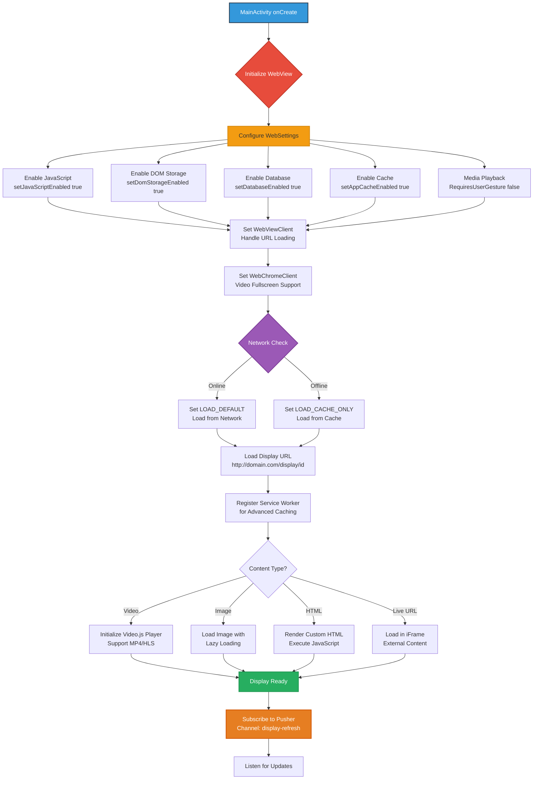
```mermaid
flowchart TD
    A[MainActivity onCreate] --> B{Initialize WebView}
    
    B --> C[Configure WebSettings]
    
    C --> D[Enable JavaScript<br/>setJavaScriptEnabled true]
    C --> E[Enable DOM Storage<br/>setDomStorageEnabled true]
    C --> F[Enable Database<br/>setDatabaseEnabled true]
    C --> G[Enable Cache<br/>setAppCacheEnabled true]
    C --> H[Media Playback<br/>RequiresUserGesture false]
    
    D --> I[Set WebViewClient<br/>Handle URL Loading]
    E --> I
    F --> I
    G --> I
    H --> I
    
    I --> J[Set WebChromeClient<br/>Video Fullscreen Support]
    
    J --> K{Network Check}
    
    K -->|Online| L[Set LOAD_DEFAULT<br/>Load from Network]
    K -->|Offline| M[Set LOAD_CACHE_ONLY<br/>Load from Cache]
    
    L --> N[Load Display URL<br/>http://domain.com/display/id]
    M --> N
    
    N --> O[Register Service Worker<br/>for Advanced Caching]
    
    O --> P{Content Type?}
    
    P -->|Video| Q[Initialize Video.js Player<br/>Support MP4/HLS]
    P -->|Image| R[Load Image with<br/>Lazy Loading]
    P -->|HTML| S[Render Custom HTML<br/>Execute JavaScript]
    P -->|Live URL| T[Load in iFrame<br/>External Content]
    
    Q --> U[Display Ready]
    R --> U
    S --> U
    T --> U
    
    U --> V[Subscribe to Pusher<br/>Channel: display-refresh]
    
    V --> W[Listen for Updates]
    
    style A fill:#3498db,stroke:#2c3e50,stroke-width:2px,color:#fff
    style B fill:#e74c3c,stroke:#c0392b,stroke-width:2px,color:#fff
    style C fill:#f39c12,stroke:#d68910,stroke-width:2px
    style K fill:#9b59b6,stroke:#7d3c98,stroke-width:2px,color:#fff
    style U fill:#27ae60,stroke:#229954,stroke-width:2px,color:#fff
    style V fill:#e67e22,stroke:#d35400,stroke-width:2px,color:#fff
```

---

## 16. Kiosk Mode Implementation Flow

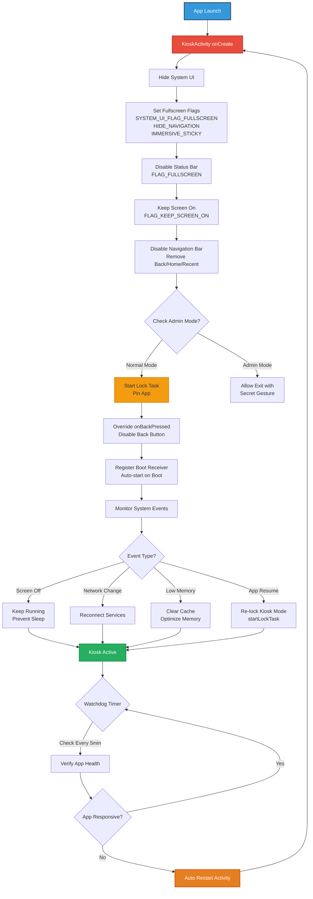
```mermaid
flowchart TD
    A[App Launch] --> B[KioskActivity onCreate]
    
    B --> C[Hide System UI]
    
    C --> D[Set Fullscreen Flags<br/>SYSTEM_UI_FLAG_FULLSCREEN<br/>HIDE_NAVIGATION<br/>IMMERSIVE_STICKY]
    
    D --> E[Disable Status Bar<br/>FLAG_FULLSCREEN]
    
    E --> F[Keep Screen On<br/>FLAG_KEEP_SCREEN_ON]
    
    F --> G[Disable Navigation Bar<br/>Remove Back/Home/Recent]
    
    G --> H{Check Admin Mode?}
    
    H -->|Normal Mode| I[Start Lock Task<br/>Pin App]
    H -->|Admin Mode| J[Allow Exit with<br/>Secret Gesture]
    
    I --> K[Override onBackPressed<br/>Disable Back Button]
    
    K --> L[Register Boot Receiver<br/>Auto-start on Boot]
    
    L --> M[Monitor System Events]
    
    M --> N{Event Type?}
    
    N -->|Screen Off| O[Keep Running<br/>Prevent Sleep]
    N -->|Network Change| P[Reconnect Services]
    N -->|Low Memory| Q[Clear Cache<br/>Optimize Memory]
    N -->|App Resume| R[Re-lock Kiosk Mode<br/>startLockTask]
    
    O --> S[Kiosk Active]
    P --> S
    Q --> S
    R --> S
    
    S --> T{Watchdog Timer}
    
    T -->|Check Every 5min| U[Verify App Health]
    
    U --> V{App Responsive?}
    
    V -->|Yes| T
    V -->|No| W[Auto Restart Activity]
    
    W --> B
    
    style A fill:#3498db,stroke:#2c3e50,stroke-width:2px,color:#fff
    style B fill:#e74c3c,stroke:#c0392b,stroke-width:2px,color:#fff
    style I fill:#f39c12,stroke:#d68910,stroke-width:2px
    style S fill:#27ae60,stroke:#229954,stroke-width:2px,color:#fff
    style W fill:#e67e22,stroke:#d35400,stroke-width:2px,color:#fff
```

---

## 17. Device Registration & Authentication Flow

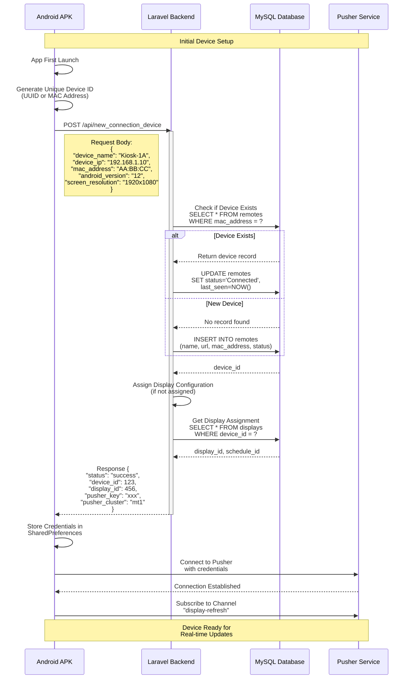
```mermaid
sequenceDiagram
    participant APK as Android APK
    participant Laravel as Laravel Backend
    participant DB as MySQL Database
    participant Pusher as Pusher Service
    
    Note over APK,Pusher: Initial Device Setup
    
    APK->>APK: App First Launch
    APK->>APK: Generate Unique Device ID<br/>(UUID or MAC Address)
    
    APK->>Laravel: POST /api/new_connection_device
    activate Laravel
    
    Note right of APK: Request Body:<br/>{<br/>  "device_name": "Kiosk-1A",<br/>  "device_ip": "192.168.1.10",<br/>  "mac_address": "AA:BB:CC",<br/>  "android_version": "12",<br/>  "screen_resolution": "1920x1080"<br/>}
    
    Laravel->>DB: Check if Device Exists<br/>SELECT * FROM remotes<br/>WHERE mac_address = ?
    
    alt Device Exists
        DB-->>Laravel: Return device record
        Laravel->>DB: UPDATE remotes<br/>SET status='Connected',<br/>last_seen=NOW()
    else New Device
        DB-->>Laravel: No record found
        Laravel->>DB: INSERT INTO remotes<br/>(name, url, mac_address, status)
    end
    
    DB-->>Laravel: device_id
    
    Laravel->>Laravel: Assign Display Configuration<br/>(if not assigned)
    
    Laravel->>DB: Get Display Assignment<br/>SELECT * FROM displays<br/>WHERE device_id = ?
    
    DB-->>Laravel: display_id, schedule_id
    
    Laravel-->>APK: Response {<br/>  "status": "success",<br/>  "device_id": 123,<br/>  "display_id": 456,<br/>  "pusher_key": "xxx",<br/>  "pusher_cluster": "mt1"<br/>}
    deactivate Laravel
    
    APK->>APK: Store Credentials in<br/>SharedPreferences
    
    APK->>Pusher: Connect to Pusher<br/>with credentials
    
    Pusher-->>APK: Connection Established
    
    APK->>Pusher: Subscribe to Channel<br/>"display-refresh"
    
    Note over APK,Pusher: Device Ready for<br/>Real-time Updates
```

---

## 18. Media Download & Caching Strategy

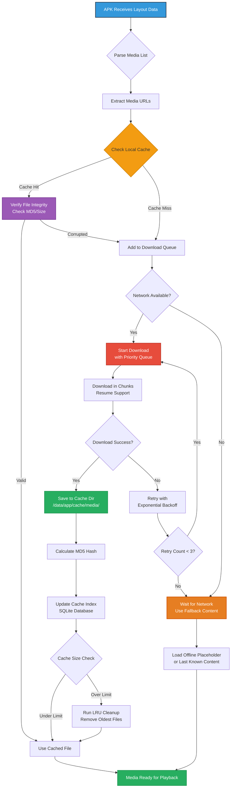
```mermaid
flowchart TD
    A[APK Receives Layout Data] --> B{Parse Media List}
    
    B --> C[Extract Media URLs]
    
    C --> D{Check Local Cache}
    
    D -->|Cache Hit| E[Verify File Integrity<br/>Check MD5/Size]
    D -->|Cache Miss| F[Add to Download Queue]
    
    E -->|Valid| G[Use Cached File]
    E -->|Corrupted| F
    
    F --> H{Network Available?}
    
    H -->|Yes| I[Start Download<br/>with Priority Queue]
    H -->|No| J[Wait for Network<br/>Use Fallback Content]
    
    I --> K[Download in Chunks<br/>Resume Support]
    
    K --> L{Download Success?}
    
    L -->|Yes| M[Save to Cache Dir<br/>/data/app/cache/media/]
    L -->|No| N[Retry with<br/>Exponential Backoff]
    
    N --> O{Retry Count < 3?}
    
    O -->|Yes| I
    O -->|No| J
    
    M --> P[Calculate MD5 Hash]
    
    P --> Q[Update Cache Index<br/>SQLite Database]
    
    Q --> R{Cache Size Check}
    
    R -->|Under Limit| G
    R -->|Over Limit| S[Run LRU Cleanup<br/>Remove Oldest Files]
    
    S --> G
    
    G --> T[Media Ready for Playback]
    
    J --> U[Load Offline Placeholder<br/>or Last Known Content]
    
    U --> T
    
    style A fill:#3498db,stroke:#2c3e50,stroke-width:2px,color:#fff
    style D fill:#f39c12,stroke:#d68910,stroke-width:2px
    style E fill:#9b59b6,stroke:#7d3c98,stroke-width:2px,color:#fff
    style I fill:#e74c3c,stroke:#c0392b,stroke-width:2px,color:#fff
    style M fill:#27ae60,stroke:#229954,stroke-width:2px,color:#fff
    style T fill:#27ae60,stroke:#229954,stroke-width:2px,color:#fff
    style J fill:#e67e22,stroke:#d35400,stroke-width:2px,color:#fff
```

---

## 19. Schedule Time-based Switching

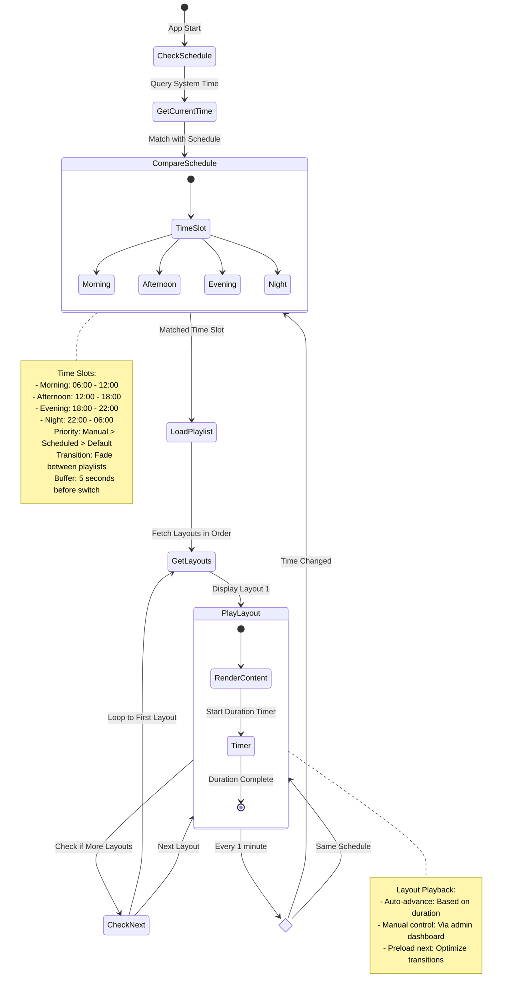
```mermaid
stateDiagram-v2
    [*] --> CheckSchedule: App Start
    
    CheckSchedule --> GetCurrentTime: Query System Time
    
    GetCurrentTime --> CompareSchedule: Match with Schedule
    
    state CompareSchedule {
        [*] --> TimeSlot
        TimeSlot --> Morning
        TimeSlot --> Afternoon
        TimeSlot --> Evening
        TimeSlot --> Night
    }
    
    CompareSchedule --> LoadPlaylist: Matched Time Slot
    
    LoadPlaylist --> GetLayouts: Fetch Layouts in Order
    
    GetLayouts --> PlayLayout: Display Layout 1
    
    state PlayLayout {
        [*] --> RenderContent
        RenderContent --> Timer: Start Duration Timer
        Timer --> [*]: Duration Complete
    }
    
    PlayLayout --> CheckNext: Check if More Layouts
    
    CheckNext --> PlayLayout: Next Layout
    CheckNext --> GetLayouts: Loop to First Layout
    
    state CheckScheduleChange <<choice>>
    PlayLayout --> CheckScheduleChange: Every 1 minute
    
    CheckScheduleChange --> CompareSchedule: Time Changed
    CheckScheduleChange --> PlayLayout: Same Schedule
    
    note right of CompareSchedule
        Time Slots:
        - Morning: 06:00 - 12:00
        - Afternoon: 12:00 - 18:00
        - Evening: 18:00 - 22:00
        - Night: 22:00 - 06:00
        
        Priority: Manual > Scheduled > Default
        Transition: Fade between playlists
        Buffer: 5 seconds before switch
    end note
    
    note right of PlayLayout
        Layout Playback:
        - Auto-advance: Based on duration
        - Manual control: Via admin dashboard
        - Preload next: Optimize transitions
    end note
```

---

## 20. Error Handling & Recovery Flow

```mermaid
flowchart TD
    A[App Running] --> B{Error Detected}
    
    B -->|Network Error| C[Network Error Handler]
    B -->|Media Error| D[Media Error Handler]
    B -->|Layout Error| E[Layout Error Handler]
    B -->|System Error| F[System Error Handler]
    
    C --> C1{Error Type?}
    C1 -->|Connection Lost| C2[Switch to Offline Mode<br/>Use Cached Content]
    C1 -->|Timeout| C3[Retry with<br/>Exponential Backoff]
    C1 -->|DNS Error| C4[Use Backup Server<br/>if configured]
    
    C2 --> G[Log Error to Local DB]
    C3 --> G
    C4 --> G
    
    D --> D1{Media Type?}
    D1 -->|Video Codec| D2[Try Alternative Player<br/>ExoPlayer → MediaPlayer]
    D1 -->|File Not Found| D3[Re-download Media<br/>Clear Cache]
    D1 -->|Streaming Error| D4[Switch to Cached Version<br/>or Skip]
    
    D2 --> G
    D3 --> G
    D4 --> G
    
    E --> E1{Layout Issue?}
    E1 -->|Parse Error| E2[Use Last Known<br/>Good Layout]
    E1 -->|Missing Media| E3[Display Placeholder<br/>Continue Playback]
    E1 -->|Invalid Grid| E4[Reset to Default<br/>Template]
    
    E2 --> G
    E3 --> G
    E4 --> G
    
    F --> F1{Critical?}
    F1 -->|Yes| F2[Send Alert to<br/>Admin Dashboard]
    F1 -->|No| F3[Log & Continue]
    
    F2 --> F4[Restart Activity<br/>or Service]
    F3 --> G
    
    F4 --> H{Restart Count?}
    
    H -->|< 3 times| I[Restart App]
    H -->|≥ 3 times| J[Reboot Device<br/>Last Resort]
    
    G --> K{Can Continue?}
    
    K -->|Yes| L[Resume Normal Operation]
    K -->|No| M[Enter Safe Mode<br/>Show Error Screen]
    
    I --> A
    J --> A
    L --> A
    
    M --> N[Wait for Manual<br/>Intervention or<br/>Auto-recover Timer]
    
    N --> O{Timer Expired?}
    O -->|Yes| I
    O -->|No| N
    
    style B fill:#e74c3c,stroke:#c0392b,stroke-width:2px,color:#fff
    style C fill:#f39c12,stroke:#d68910,stroke-width:2px
    style D fill:#f39c12,stroke:#d68910,stroke-width:2px
    style E fill:#f39c12,stroke:#d68910,stroke-width:2px
    style F fill:#f39c12,stroke:#d68910,stroke-width:2px
    style G fill:#9b59b6,stroke:#7d3c98,stroke-width:2px,color:#fff
    style L fill:#27ae60,stroke:#229954,stroke-width:2px,color:#fff
    style M fill:#e67e22,stroke:#d35400,stroke-width:2px,color:#fff
```

---

## 21. Admin Dashboard Real-time Monitoring

```mermaid
graph TB
    subgraph "Admin Dashboard UI"
        A[Dashboard Page Load]
        B[Device Status Widget]
        C[Media Playback Chart]
        D[System Health Metrics]
        E[Live Device Map]
    end
    
    subgraph "Data Sources"
        F[Remote-Android Service<br/>SSE Stream Port 3001]
        G[Generate-PDF Service<br/>Data API Port 3333]
        H[Laravel Backend<br/>REST API]
        I[Pusher WebSocket<br/>Real-time Events]
    end
    
    subgraph "Real-time Updates"
        J[SSE Connection<br/>Every 3 seconds]
        K[Chart.js<br/>Auto-refresh]
        L[WebSocket<br/>Instant Push]
    end
    
    A --> B
    A --> C
    A --> D
    A --> E
    
    B --> F
    B --> J
    
    C --> G
    C --> K
    
    D --> H
    D --> L
    
    E --> F
    E --> I
    
    F -->|Stream| J
    J -->|Update UI| B
    J -->|Update UI| E
    
    G -->|Fetch| K
    K -->|Render| C
    
    H -->|Query| L
    I -->|Push| L
    L -->|Update| D
    
    style A fill:#3498db,stroke:#2c3e50,stroke-width:2px,color:#fff
    style F fill:#e74c3c,stroke:#c0392b,stroke-width:2px,color:#fff
    style G fill:#e74c3c,stroke:#c0392b,stroke-width:2px,color:#fff
    style H fill:#e74c3c,stroke:#c0392b,stroke-width:2px,color:#fff
    style I fill:#e67e22,stroke:#d35400,stroke-width:2px,color:#fff
    style J fill:#27ae60,stroke:#229954,stroke-width:2px,color:#fff
    style K fill:#27ae60,stroke:#229954,stroke-width:2px,color:#fff
    style L fill:#27ae60,stroke:#229954,stroke-width:2px,color:#fff
```

---

## 22. Backup & Recovery Process

```mermaid
sequenceDiagram
    participant Cron as Cron Job
    participant Script as Backup Script
    participant MySQL as MySQL Database
    participant Files as File System
    participant S3 as AWS S3 Storage
    participant Alert as Alert System
    
    Note over Cron,Alert: Daily Backup Process (02:00 AM)
    
    Cron->>Script: Trigger Daily Backup
    activate Script
    
    Script->>Script: Generate Timestamp<br/>2026-01-21_020000
    
    par Database Backup
        Script->>MySQL: mysqldump platform
        MySQL-->>Script: SQL dump file
        Script->>Script: Compress to .sql.gz
    and Files Backup
        Script->>Files: tar storage/app
        Files-->>Script: storage.tar.gz
        Script->>Files: tar public/content
        Files-->>Script: content.tar.gz
    end
    
    Script->>Script: Verify Backup Integrity<br/>(Check file size & MD5)
    
    alt Backup Valid
        Script->>S3: Upload db_2026-01-21.sql.gz
        S3-->>Script: Upload Success
        
        Script->>S3: Upload storage_2026-01-21.tar.gz
        S3-->>Script: Upload Success
        
        Script->>Script: Log Success
        
        Script->>Script: Cleanup Old Backups<br/>(Remove > 30 days)
        
        Script->>Alert: Send Success Notification<br/>(Email/Slack)
    else Backup Failed
        Script->>Alert: Send Alert: Backup Failed
        Script->>Script: Log Error
        Script->>Script: Retry (max 3 times)
    end
    
    deactivate Script
    
    Note over Cron,Alert: Recovery Process (Manual)
    
    Admin->>Script: Trigger Recovery<br/>./restore.sh 2026-01-21
    activate Script
    
    Script->>S3: Download Backup Files
    S3-->>Script: db.sql.gz, storage.tar.gz
    
    Script->>Script: Verify Download Integrity
    
    Script->>MySQL: Stop App (docker-compose down)
    
    Script->>MySQL: mysql < backup.sql
    MySQL-->>Script: Database Restored
    
    Script->>Files: Extract storage.tar.gz
    Files-->>Script: Files Restored
    
    Script->>Script: Fix Permissions<br/>chown www-data:www-data
    
    Script->>MySQL: Start App (docker-compose up)
    
    Script->>Script: Clear Caches<br/>php artisan cache:clear
    
    Script-->>Admin: Recovery Complete
    deactivate Script
    
    Note over Cron,Alert: Retention Policy:<br/>- Daily: 30 days<br/>- Weekly: 90 days<br/>- Monthly: 1 year
```

---

## 23. Video Transcoding Pipeline

```mermaid
flowchart LR
    A[User Upload Video] --> B{Check Format}
    
    B -->|Supported<br/>MP4/H.264| C[Quick Validation]
    B -->|Unsupported<br/>AVI/MOV/MKV| D[Queue for<br/>Transcoding]
    
    C --> E{Video Size?}
    
    E -->|< 100MB| F[Direct Save<br/>to Storage]
    E -->|> 100MB| G[Optimize<br/>Compression]
    
    D --> H[FFmpeg Worker]
    G --> H
    
    H --> I[Transcoding Job]
    
    I --> J[Convert to H.264<br/>AAC Audio]
    
    J --> K[Multiple Bitrates]
    
    K --> L[1080p<br/>5 Mbps]
    K --> M[720p<br/>2.5 Mbps]
    K --> N[480p<br/>1 Mbps]
    
    L --> O[Generate Thumbnail<br/>Extract at 00:00:05]
    M --> O
    N --> O
    
    O --> P[Generate Preview<br/>10-second clip]
    
    P --> Q[Optimize for Web<br/>moov atom front]
    
    Q --> R[Save to Storage<br/>S3/MinIO]
    
    F --> R
    
    R --> S[Update Database<br/>Set status='ready']
    
    S --> T[Clear Cache<br/>Invalidate CDN]
    
    T --> U[Notify Admin<br/>via WebSocket]
    
    U --> V{Auto-publish?}
    
    V -->|Yes| W[Add to Playlist]
    V -->|No| X[Save as Draft]
    
    W --> Y[Trigger Display<br/>Refresh]
    X --> Z[End]
    Y --> Z
    
    style A fill:#3498db,stroke:#2c3e50,stroke-width:2px,color:#fff
    style H fill:#e74c3c,stroke:#c0392b,stroke-width:2px,color:#fff
    style I fill:#f39c12,stroke:#d68910,stroke-width:2px
    style R fill:#27ae60,stroke:#229954,stroke-width:2px,color:#fff
    style U fill:#9b59b6,stroke:#7d3c98,stroke-width:2px,color:#fff
```

---

**Generated:** January 22, 2026  
**Version:** 1.2 (Updated - Verified dengan implementasi aktual)  
**Platform:** Cosmic Media Streaming - Digital Signage CMS

**Total Diagrams:** 23 comprehensive Mermaid diagrams covering all system flows and architectures

**🎯 Verifikasi Implementasi:**
- ✅ 3 Backend Services: cosmic-media-streaming-dpr, generate-pdf, remote-android-device
- ✅ 1 Client APK: kiosk-touchscreen-dpr-app (Android Kiosk)
- ✅ Shared Network: kiosk-net (172.28.0.0/16)
- ✅ Database: MariaDB 10.11 (bind mount: ./docker-data/mariadb)
- ✅ Cache/Queue: Redis 7 (bind mount: ./docker-data/redis)
- ✅ Storage: MinIO (bind mount: ./docker-data/minio)
- ✅ Deploy script: Zero-downtime deployment dengan git pull + docker compose up
