# DOKUMENTASI TEKNIS
## Cosmic Media Streaming Platform
### Digital Signage & Kiosk Management System

---

**Versi Dokumen:** 2.0  
**Tanggal:** 28 Januari 2026  
**Status:** Final  
**Update:** Production Ready with Docker Infrastructure

---

## DAFTAR ISI

1. [RINGKASAN EKSEKUTIF](#1-ringkasan-eksekutif)
2. [ARSITEKTUR SISTEM](#2-arsitektur-sistem)
3. [COSMIC-MEDIA-STREAMING-DPR (Backend Core)](#3-cosmic-media-streaming-dpr-backend-core)
4. [GENERATE-PDF (PDF Generation Service)](#4-generate-pdf-pdf-generation-service)
5. [REMOTE-ANDROID-DEVICE (Device Management)](#5-remote-android-device-device-management)
6. [INTEGRASI DENGAN APK ANDROID](#6-integrasi-dengan-apk-android)
7. [DEPLOYMENT & INFRASTRUCTURE](#7-deployment--infrastructure)
8. [SECURITY & PERFORMANCE](#8-security--performance)
9. [MAINTENANCE & TROUBLESHOOTING](#9-maintenance--troubleshooting)

---

# 1. RINGKASAN EKSEKUTIF

## 1.1. Tentang Project

**Cosmic Media Streaming Platform** adalah sistem manajemen konten digital (Digital Signage) yang dirancang khusus untuk mengelola tampilan informasi di berbagai perangkat kiosk Android. Platform ini memungkinkan administrator untuk:

- 📺 Mengelola konten multimedia (video, gambar, HTML, live stream)
- 📅 Membuat jadwal tayang otomatis
- 🎨 Merancang layout tampilan custom dengan drag-and-drop
- 📊 Monitoring real-time status perangkat
- 📄 Generate laporan PDF otomatis
- 🔄 Update konten secara real-time ke semua perangkat

## 1.2. Komponen Utama

Platform ini terdiri dari 3 microservices utama:

### 1.2.1. Cosmic Media Streaming (Laravel - PHP)
**Backend core system** yang menangani:
- Manajemen user & authentication
- CRUD untuk media, playlist, schedule, layout
- API untuk Android APK
- Real-time broadcasting dengan Pusher/WebSocket
- Queue system untuk background jobs
- Integration dengan MinIO S3 storage

### 1.2.2. Generate-PDF (Node.js)
**PDF generation service** yang menangani:
- Generate PDF dari HTML template
- Custom layout editor (drag & drop)
- WebSocket untuk real-time refresh
- Screenshot & export untuk reporting

### 1.2.3. Remote-Android-Device (Python FastAPI)
**Device monitoring service** yang menangani:
- Real-time device health check (parallel processing)
- Server-Sent Events (SSE) untuk status streaming
- Device analytics & reporting
- Service status aggregation

## 1.3. Teknologi Stack

| Layer | Technology | Version |
|-------|-----------|---------|
| **Backend Framework** | Laravel | 10.x |
| **Frontend** | Filament Admin Panel | 3.x |
| **Database** | MariaDB | 10.11 |
| **Cache & Queue** | Redis | 7.x |
| **Object Storage** | MinIO (S3-compatible) | Latest |
| **PDF Service** | Node.js + Puppeteer | 18.x LTS |
| **Device Monitor** | Python FastAPI | 3.9+ |
| **Web Server** | Nginx | Latest Alpine |
| **Container** | Docker + Docker Compose | Latest |
| **Process Manager** | Supervisor | Latest |
| **Real-time** | Pusher / Laravel WebSockets | Latest |

## 1.4. Server Specifications (Current Production)

### Production Environment
- **Server OS:** Ubuntu 22.04 LTS
- **RAM:** 8 GB
- **CPU:** 4 Cores
- **Storage:** 100 GB SSD
- **Network:** 1 Gbps

### Container Distribution
| Service | Container Name | CPU | RAM | Replicas |
|---------|---------------|-----|-----|----------|
| Laravel App | cosmic-app-{1,2,3}-prod | 1 core | 2 GB | 3 |
| MariaDB | platform-db-prod | 2 cores | 2 GB | 1 |
| Redis | platform-redis-prod | 1 core | 2 GB | 1 |
| MinIO | platform-minio-prod | 1 core | 1 GB | 1 |
| Nginx LB | platform-nginx-prod | 1 core | 512 MB | 1 |
| PDF Service | generate-pdf-prod | 1 core | 2 GB | 1 |
| Android Service | remote-android-prod | 1 core | 1 GB | 1 |
| Queue Workers | cosmic-queue-*-prod | 0.5 core | 1 GB | 9 |
| Scheduler | cosmic-scheduler-prod | 0.5 core | 512 MB | 1 |

### Domain & URLs
- **Production URL:** `https://kiosk.mugshot.dev`
- **Admin Panel:** `https://kiosk.mugshot.dev/back-office`
- **API Base:** `https://kiosk.mugshot.dev/api`
- **MinIO Console:** `https://kiosk.mugshot.dev:9001`
- **Nginx Ports:** 8080 (HTTP), 8443 (HTTPS)

---

# 2. ARSITEKTUR SISTEM

## 2.1. Gambaran Umum Sistem

Platform ini menggunakan arsitektur **Microservices** dengan komunikasi berbasis HTTP/REST API dan Real-time WebSocket. Setiap service memiliki tanggung jawab spesifik dan dapat di-scale secara independen.

### Prinsip Arsitektur:
1. **Separation of Concerns** - Setiap service fokus pada satu domain
2. **Scalability** - Load balancing dengan 3 Laravel app replicas
3. **High Availability** - Health checks & auto-restart
4. **Performance** - Redis caching & queue workers
5. **Security** - Container isolation & network segmentation

## 2.2. System Architecture Diagram


## 2.3. Data Flow Architecture


## 2.4. Network Architecture


### Network Components:
- **Load Balancer:** Nginx reverse proxy with sticky session (cookie-based routing)
- **Application Layer:** 3 Laravel containers for high availability
- **Microservices:** PDF generation and device management services
- **Background Workers:** 9 queue workers (3 video, 3 image, 2 default) + 1 scheduler
- **Data Layer:** MariaDB, Redis (cache & queue), MinIO (object storage)
- **Network:** Docker bridge network (kiosk-net) for internal communication
- **External Access:** Ports 8080 (HTTP), 8443 (HTTPS), 3306 (DB), 6379 (Redis), 9000-9001 (MinIO)

---

# 3. COSMIC-MEDIA-STREAMING-DPR (Backend Core)

## 3.1. Deskripsi Project

**Cosmic Media Streaming DPR** adalah backend core yang dibangun dengan **Laravel 10** dan **Filament Admin Panel**. Project ini bertanggung jawab untuk:

- 🔐 Autentikasi & otorisasi pengguna (Spatie Permissions)
- 📦 Manajemen CRUD untuk semua entitas (Media, Playlist, Schedule, Display, Layout)
- 🎨 Custom layout builder dengan drag-and-drop spots
- 📡 API endpoints untuk Android APK
- ⚡ Real-time broadcasting dengan Pusher
- 🗄️ Integration dengan MinIO S3 storage
- ⏰ Background jobs dengan Redis Queue
- 📊 Reporting & analytics

## 3.2. Stack Teknologi

| Komponen | Teknologi | Versi | Fungsi |
|----------|-----------|-------|--------|
| **Framework** | Laravel | 10.48.x | PHP Framework |
| **PHP** | PHP-FPM | 8.3.30 | Runtime |
| **Admin Panel** | Filament | 3.2.x | Backend UI |
| **Database** | MariaDB | 10.11 | Relational DB |
| **Cache** | Redis | 7.x | Cache & Session |
| **Queue** | Redis | 7.x | Job Queue |
| **Storage** | MinIO (S3) | Latest | Object Storage |
| **Web Server** | Nginx | Alpine | Reverse Proxy |
| **Process Manager** | Supervisor | Latest | Service Manager |
| **Image Processing** | GD Extension | - | Image manipulation |
| **Video Processing** | FFmpeg | 7.x | Video encoding |
| **PDF Generation** | DomPDF | 2.x | PDF export |

## 3.3. Struktur Database

### ERD (Entity Relationship Diagram)


### Tabel Utama

#### 1. users
```sql
CREATE TABLE users (
    id BIGINT UNSIGNED AUTO_INCREMENT PRIMARY KEY,
    name VARCHAR(255) NOT NULL,
    email VARCHAR(255) UNIQUE NOT NULL,
    email_verified_at TIMESTAMP NULL,
    password VARCHAR(255) NOT NULL,
    remember_token VARCHAR(100) NULL,
    created_at TIMESTAMP NULL,
    updated_at TIMESTAMP NULL,
    INDEX idx_email (email)
) ENGINE=InnoDB DEFAULT CHARSET=utf8mb4 COLLATE=utf8mb4_unicode_ci;
```

#### 2. media
```sql
CREATE TABLE media (
    id BIGINT UNSIGNED AUTO_INCREMENT PRIMARY KEY,
    uuid CHAR(36) UNIQUE NOT NULL,
    model_type VARCHAR(255) NOT NULL,
    model_id BIGINT UNSIGNED NOT NULL,
    collection_name VARCHAR(255) NOT NULL,
    name VARCHAR(255) NOT NULL,
    file_name VARCHAR(255) NOT NULL,
    mime_type VARCHAR(255) NULL,
    disk VARCHAR(255) NOT NULL,
    conversions_disk VARCHAR(255) NULL,
    size BIGINT UNSIGNED NOT NULL,
    manipulations JSON NULL,
    custom_properties JSON NULL,
    generated_conversions JSON NULL,
    responsive_images JSON NULL,
    order_column INT UNSIGNED NULL,
    created_at TIMESTAMP NULL,
    updated_at TIMESTAMP NULL,
    INDEX idx_model (model_type, model_id),
    INDEX idx_collection (collection_name),
    FULLTEXT idx_search (name, file_name)
) ENGINE=InnoDB DEFAULT CHARSET=utf8mb4 COLLATE=utf8mb4_unicode_ci;
```

#### 3. displays
```sql
CREATE TABLE displays (
    id BIGINT UNSIGNED AUTO_INCREMENT PRIMARY KEY,
    name VARCHAR(255) NOT NULL,
    description TEXT NULL,
    mac_address VARCHAR(17) UNIQUE NOT NULL,
    ip_address VARCHAR(45) NULL,
    location VARCHAR(255) NULL,
    schedule_id BIGINT UNSIGNED NULL,
    remote_id BIGINT UNSIGNED NULL,
    status ENUM('online', 'offline', 'maintenance') DEFAULT 'offline',
    last_seen TIMESTAMP NULL,
    settings JSON NULL,
    created_at TIMESTAMP NULL,
    updated_at TIMESTAMP NULL,
    FOREIGN KEY (schedule_id) REFERENCES schedules(id) ON DELETE SET NULL,
    FOREIGN KEY (remote_id) REFERENCES remotes(id) ON DELETE SET NULL,
    INDEX idx_status (status),
    INDEX idx_mac (mac_address)
) ENGINE=InnoDB DEFAULT CHARSET=utf8mb4 COLLATE=utf8mb4_unicode_ci;
```

#### 4. schedules
```sql
CREATE TABLE schedules (
    id BIGINT UNSIGNED AUTO_INCREMENT PRIMARY KEY,
    name VARCHAR(255) NOT NULL,
    description TEXT NULL,
    start_time TIME NULL,
    end_time TIME NULL,
    days_of_week JSON NULL COMMENT '["monday","tuesday",...]',
    is_active BOOLEAN DEFAULT TRUE,
    priority INT DEFAULT 0,
    created_at TIMESTAMP NULL,
    updated_at TIMESTAMP NULL,
    INDEX idx_active (is_active),
    INDEX idx_priority (priority)
) ENGINE=InnoDB DEFAULT CHARSET=utf8mb4 COLLATE=utf8mb4_unicode_ci;
```

#### 5. playlists
```sql
CREATE TABLE playlists (
    id BIGINT UNSIGNED AUTO_INCREMENT PRIMARY KEY,
    name VARCHAR(255) NOT NULL,
    description TEXT NULL,
    duration INT UNSIGNED NOT NULL COMMENT 'in seconds',
    schedule_id BIGINT UNSIGNED NOT NULL,
    order_column INT UNSIGNED DEFAULT 0,
    is_active BOOLEAN DEFAULT TRUE,
    created_at TIMESTAMP NULL,
    updated_at TIMESTAMP NULL,
    FOREIGN KEY (schedule_id) REFERENCES schedules(id) ON DELETE CASCADE,
    INDEX idx_schedule (schedule_id),
    INDEX idx_order (order_column)
) ENGINE=InnoDB DEFAULT CHARSET=utf8mb4 COLLATE=utf8mb4_unicode_ci;
```

#### 6. layouts
```sql
CREATE TABLE layouts (
    id BIGINT UNSIGNED AUTO_INCREMENT PRIMARY KEY,
    name VARCHAR(255) NOT NULL,
    description TEXT NULL,
    width INT UNSIGNED DEFAULT 1920,
    height INT UNSIGNED DEFAULT 1080,
    background_color VARCHAR(7) DEFAULT '#000000',
    background_image TEXT NULL,
    playlist_id BIGINT UNSIGNED NULL,
    configuration JSON NULL,
    is_template BOOLEAN DEFAULT FALSE,
    created_at TIMESTAMP NULL,
    updated_at TIMESTAMP NULL,
    FOREIGN KEY (playlist_id) REFERENCES playlists(id) ON DELETE CASCADE,
    INDEX idx_playlist (playlist_id),
    INDEX idx_template (is_template)
) ENGINE=InnoDB DEFAULT CHARSET=utf8mb4 COLLATE=utf8mb4_unicode_ci;
```

#### 7. spots
```sql
CREATE TABLE spots (
    id BIGINT UNSIGNED AUTO_INCREMENT PRIMARY KEY,
    name VARCHAR(255) NOT NULL,
    x_position INT NOT NULL DEFAULT 0,
    y_position INT NOT NULL DEFAULT 0,
    width INT UNSIGNED NOT NULL,
    height INT UNSIGNED NOT NULL,
    z_index INT DEFAULT 0,
    layout_id BIGINT UNSIGNED NOT NULL,
    media_id BIGINT UNSIGNED NULL,
    content_type ENUM('media','html','livestream','clock','weather') DEFAULT 'media',
    content_data JSON NULL,
    animation_in VARCHAR(50) NULL,
    animation_out VARCHAR(50) NULL,
    duration INT UNSIGNED NULL COMMENT 'override duration in seconds',
    order_column INT UNSIGNED DEFAULT 0,
    settings JSON NULL,
    created_at TIMESTAMP NULL,
    updated_at TIMESTAMP NULL,
    FOREIGN KEY (layout_id) REFERENCES layouts(id) ON DELETE CASCADE,
    FOREIGN KEY (media_id) REFERENCES media(id) ON DELETE SET NULL,
    INDEX idx_layout (layout_id),
    INDEX idx_order (order_column)
) ENGINE=InnoDB DEFAULT CHARSET=utf8mb4 COLLATE=utf8mb4_unicode_ci;
```

#### 8. remotes (Android Devices)
```sql
CREATE TABLE remotes (
    id BIGINT UNSIGNED AUTO_INCREMENT PRIMARY KEY,
    name VARCHAR(255) NOT NULL,
    ip_address VARCHAR(45) UNIQUE NOT NULL,
    port INT UNSIGNED DEFAULT 80,
    status ENUM('connected','disconnected','error') DEFAULT 'disconnected',
    last_checked TIMESTAMP NULL,
    response_time INT NULL COMMENT 'in milliseconds',
    device_info JSON NULL,
    created_at TIMESTAMP NULL,
    updated_at TIMESTAMP NULL,
    INDEX idx_status (status),
    INDEX idx_ip (ip_address)
) ENGINE=InnoDB DEFAULT CHARSET=utf8mb4 COLLATE=utf8mb4_unicode_ci;
```

## 3.4. API Endpoints

### Authentication
| Method | Endpoint | Description | Auth |
|--------|----------|-------------|------|
| POST | `/api/login` | User login | ❌ |
| POST | `/api/logout` | User logout | ✅ |
| GET | `/api/user` | Get authenticated user | ✅ |

### Device Management
| Method | Endpoint | Description | Auth |
|--------|----------|-------------|------|
| POST | `/api/new_connection_device` | Register new device | ❌ |
| GET | `/api/devices` | List all devices | ✅ |
| GET | `/api/devices/{id}` | Get device detail | ✅ |
| PUT | `/api/devices/{id}` | Update device | ✅ |

### Display & Content
| Method | Endpoint | Description | Auth |
|--------|----------|-------------|------|
| GET | `/api/load_data/{display_id}` | Get display configuration | ❌ |
| POST | `/api/save_change/{layout_id}` | Save layout changes | ✅ |
| GET | `/api/health` | Health check | ❌ |

### Media Management
| Method | Endpoint | Description | Auth |
|--------|----------|-------------|------|
| POST | `/api/media_image/create` | Upload image | ✅ |
| POST | `/api/media_image/edit/{id}` | Edit image | ✅ |
| POST | `/api/media_video/create` | Upload video | ✅ |
| POST | `/api/media_html/create` | Create HTML content | ✅ |
| POST | `/api/media_livestream/create` | Create livestream | ✅ |

### Chart & Analytics
| Method | Endpoint | Description | Auth |
|--------|----------|-------------|------|
| GET | `/api/chart/device_status` | Device status chart | ✅ |
| GET | `/api/chart/media_usage` | Media usage stats | ✅ |
| GET | `/api/chart/playlist_analytics` | Playlist analytics | ✅ |

## 3.5. Fitur Utama

### 3.5.1. Custom Layout Builder

**Drag-and-drop interface** untuk membuat layout display dengan fitur:

- 📐 **Grid System** - Snap to grid untuk alignment presisi
- 🎨 **Multiple Spot Types:**
  - Media Spot (Image/Video)
  - HTML Spot (Custom HTML/CSS/JS)
  - Livestream Spot (HLS/RTMP)
  - Clock Widget
  - Weather Widget
  - News Ticker
- 🎭 **Animation Effects:**
  - Fade In/Out
  - Slide Left/Right/Up/Down
  - Zoom In/Out
  - Custom CSS animations
- 🔄 **Real-time Preview** - Live preview dalam editor
- 💾 **Template System** - Save & reuse layouts

**Example Layout Configuration:**
```json
{
  "layout_id": 123,
  "name": "Main Lobby Display",
  "width": 1920,
  "height": 1080,
  "background": {
    "type": "color",
    "value": "#1a1a1a"
  },
  "spots": [
    {
      "id": 1,
      "name": "Top Banner",
      "x": 0,
      "y": 0,
      "width": 1920,
      "height": 200,
      "type": "media",
      "media_id": 456,
      "animation_in": "slideDown",
      "duration": 10
    },
    {
      "id": 2,
      "name": "Main Content",
      "x": 0,
      "y": 200,
      "width": 1440,
      "height": 880,
      "type": "video",
      "media_id": 789,
      "animation_in": "fadeIn"
    },
    {
      "id": 3,
      "name": "Clock Widget",
      "x": 1440,
      "y": 200,
      "width": 480,
      "height": 400,
      "type": "clock",
      "settings": {
        "format": "HH:mm:ss",
        "timezone": "Asia/Jakarta"
      }
    }
  ]
}
```

### 3.5.2. Schedule Management

**Time-based content scheduling** dengan fitur:

- 📅 **Day-based Scheduling** - Pilih hari dalam seminggu
- ⏰ **Time Range** - Start time & end time
- 🔄 **Recurring Schedule** - Daily, weekly, custom pattern
- 🎯 **Priority System** - Priority level untuk overlapping schedules
- 🔀 **Playlist Rotation** - Multiple playlists dalam satu schedule
- 📊 **Schedule Preview** - Visual calendar preview

**Example Schedule:**
```php
Schedule::create([
    'name' => 'Weekday Morning Broadcast',
    'start_time' => '06:00:00',
    'end_time' => '12:00:00',
    'days_of_week' => ['monday', 'tuesday', 'wednesday', 'thursday', 'friday'],
    'priority' => 10,
    'is_active' => true
]);
```

### 3.5.3. Real-time Broadcasting

**Pusher WebSocket integration** untuk real-time updates:

```php
// Backend - Trigger event
use App\Events\DisplayRefreshed;

event(new DisplayRefreshed([
    'display_id' => $display->id,
    'action' => 'reload',
    'timestamp' => now()->toIso8601String()
]));
```

```javascript
// Frontend - Listen to events
const pusher = new Pusher('app-key', {
    cluster: 'mt1',
    encrypted: true
});

const channel = pusher.subscribe('display-refresh');

channel.bind('DisplayRefreshed', function(data) {
    if (data.display_id === currentDisplayId) {
        location.reload(); // Reload display
    }
});
```

### 3.5.4. Queue System

**Redis Queue** untuk background processing:

**Queue Channels:**
- `default` - General tasks (2 workers)
- `video` - Video processing with FFmpeg (3 workers)
- `image` - Image optimization (3 workers)
- `notifications` - Email/Push notifications

**Example Job:**
```php
// Dispatch job
use App\Jobs\ProcessVideoJob;

ProcessVideoJob::dispatch($media)
    ->onQueue('video')
    ->delay(now()->addSeconds(5));

// Job implementation
class ProcessVideoJob implements ShouldQueue
{
    use Dispatchable, InteractsWithQueue, Queueable, SerializesModels;
    
    public $timeout = 1800; // 30 minutes
    public $tries = 3;
    
    public function handle()
    {
        // FFmpeg video processing
        FFMpeg::fromDisk('minio')
            ->open($this->media->file_path)
            ->export()
            ->toDisk('minio')
            ->inFormat(new X264)
            ->save('processed/' . $this->media->file_name);
    }
}
```

### 3.5.5. Storage Integration (MinIO S3)

**S3-compatible storage** dengan Laravel Filesystem:

```php
// Upload file
$path = Storage::disk('minio')->put('media/videos', $request->file('video'));

// Get URL
$url = Storage::disk('minio')->url($path);

// Delete file
Storage::disk('minio')->delete($path);

// Check existence
if (Storage::disk('minio')->exists($path)) {
    // File exists
}
```

**Configuration:**
```php
// config/filesystems.php
'minio' => [
    'driver' => 's3',
    'key' => env('MINIO_KEY'),
    'secret' => env('MINIO_SECRET'),
    'region' => env('MINIO_REGION', 'us-east-1'),
    'bucket' => env('MINIO_BUCKET'),
    'endpoint' => env('MINIO_ENDPOINT'),
    'use_path_style_endpoint' => true,
],
```

---

# 4. GENERATE-PDF (PDF Generation Service)

## 4.1. Deskripsi Project

**Generate-PDF** adalah microservice berbasis **Node.js** yang menangani pembuatan PDF dari HTML template menggunakan **Puppeteer** (Headless Chrome). Service ini juga menyediakan:

- 📄 PDF generation dari HTML
- 🎨 Custom layout editor dengan real-time preview
- 📸 Screenshot & image export
- 🔌 WebSocket untuk real-time refresh
- 📊 Data visualization & charts

## 4.2. Stack Teknologi

| Komponen | Teknologi | Versi |
|----------|-----------|-------|
| **Runtime** | Node.js | 20.20.0 |
| **Package Manager** | npm | 10.8.2 |
| **Framework** | Express.js | 4.x |
| **PDF Engine** | Puppeteer | Latest |
| **WebSocket** | ws | Latest |
| **Database Driver** | mysql2 | Latest |
| **Process Manager** | PM2 | Latest |
| **Template Engine** | EJS | Latest |

## 4.3. API Endpoints

| Method | Endpoint | Description |
|--------|----------|-------------|
| GET | `/health` | Health check |
| POST | `/generate-pdf` | Generate PDF from HTML |
| GET | `/view-pdf/:id` | View PDF in browser |
| POST | `/custom-layout` | Create custom layout |
| GET | `/data-layout/:id` | Get layout data |
| POST | `/data_table` | Get data for tables |
| GET | `/status_service` | Service status |
| GET | `/graph_playlist` | Playlist analytics |
| WebSocket | `/ws` | Real-time refresh channel |

## 4.4. PDF Generation Flow


## 4.5. Custom Layout Editor

**Real-time drag-and-drop editor** dengan WebSocket:

```javascript
// WebSocket Server
const WebSocket = require('ws');
const wss = new WebSocket.Server({ port: 3335 });

wss.on('connection', (ws) => {
    console.log('Client connected');
    
    ws.on('message', (message) => {
        const data = JSON.parse(message);
        
        if (data.action === 'refresh') {
            // Broadcast to all connected clients
            wss.clients.forEach((client) => {
                if (client.readyState === WebSocket.OPEN) {
                    client.send(JSON.stringify({
                        type: 'refresh',
                        display_id: data.display_id,
                        timestamp: new Date().toISOString()
                    }));
                }
            });
        }
    });
});
```

**Client-side (Android/Browser):**
```javascript
const ws = new WebSocket('ws://generate-pdf-prod:3335/ws');

ws.onmessage = (event) => {
    const data = JSON.parse(event.data);
    
    if (data.type === 'refresh') {
        console.log('Refresh signal received');
        location.reload(); // Reload display
    }
};
```

---

# 5. REMOTE-ANDROID-DEVICE (Device Management)

## 5.1. Deskripsi Project

**Remote-Android-Device** adalah microservice berbasis **Python FastAPI** yang menangani monitoring dan management perangkat kiosk Android secara real-time dengan fitur:

- 🔍 Parallel device health checking (20 concurrent workers)
- 📡 Server-Sent Events (SSE) untuk real-time streaming
- 📊 Device analytics & reporting
- ⚡ High-performance async operations
- 🔄 Auto-reconnect & retry mechanism

## 5.2. Stack Teknologi

| Komponen | Teknologi | Versi |
|----------|-----------|-------|
| **Framework** | FastAPI | 0.104+ |
| **Python** | Python | 3.9+ |
| **Server** | Uvicorn | Latest |
| **HTTP Client** | httpx | Latest |
| **Database** | PyMySQL | Latest |
| **Async** | asyncio | Built-in |
| **Concurrency** | concurrent.futures | Built-in |

## 5.3. API Endpoints

| Method | Endpoint | Description | Response Type |
|--------|----------|-------------|---------------|
| GET | `/health` | Health check | JSON |
| GET | `/status_device` | Real-time device status | SSE Stream |
| GET | `/graph_playlist` | Playlist analytics | JSON |
| GET | `/status_service` | Service status | JSON |
| POST | `/emedia` | Trigger media update | JSON |
| POST | `/send_refresh_device` | Send refresh signal | JSON |

## 5.4. Device Health Check (Parallel Processing)

```python
import asyncio
from concurrent.futures import ThreadPoolExecutor, as_completed
import requests

# Parallel health check with 20 workers
executor = ThreadPoolExecutor(max_workers=20)

def check_device_status(device):
    """Check single device status"""
    try:
        response = requests.get(
            f"http://{device['ip_address']}:{device['port']}/ping",
            timeout=5
        )
        return {
            'device_id': device['id'],
            'status': 'Connected' if response.status_code == 200 else 'Error',
            'response_time': response.elapsed.total_seconds() * 1000
        }
    except requests.RequestException as e:
        return {
            'device_id': device['id'],
            'status': 'Disconnected',
            'error': str(e)
        }

@app.get("/status_device")
async def get_device_status():
    """Get real-time device status with SSE"""
    async def event_generator():
        while True:
            # Fetch devices from database
            devices = fetch_devices_from_db()
            
            # Parallel health check
            futures = {
                executor.submit(check_device_status, device): device 
                for device in devices
            }
            
            results = []
            for future in as_completed(futures):
                result = future.result()
                results.append(result)
                
                # Update database
                update_device_status(result['device_id'], result['status'])
            
            # Send SSE event
            yield f"data: {json.dumps(results)}\n\n"
            
            await asyncio.sleep(3)  # Check every 3 seconds
    
    return EventSourceResponse(event_generator())
```

## 5.5. Integrasi dengan Core System

```mermaid
sequenceDiagram
    participant Admin as Admin Dashboard
    participant Service as Remote-Android Service
    participant DB as Database
    participant Device1 as Device 1
    participant Device2 as Device 2
    participant Device3 as Device 3
    
    Note over Admin,DB: Real-time Device Monitoring Flow
    
    Admin->>Admin: 1. Load Device Monitor Page
    
    Admin->>Service: 2. Subscribe to SSE Stream<br/>GET /status_device
    activate Service
    
    Service->>DB: 3. Query Device List<br/>SELECT * FROM remotes
    activate DB
    DB-->>Service: [device1, device2, device3, ...]
    deactivate DB
    
    Note over Service,Device3: 4. Parallel Health Check (20 workers)
    
    par Check Device 1
        Service->>Device1: GET http://device1/ping
        Device1-->>Service: HTTP 200 OK
    and Check Device 2
        Service->>Device2: GET http://device2/ping
        Device2-->>Service: HTTP 200 OK
    and Check Device 3
        Service->>Device3: GET http://device3/ping
        Device3-->>Service: Timeout/Error
    end
    
    Service->>DB: 5. Update Status<br/>UPDATE remotes<br/>SET status = 'Connected/Disconnected'
    activate DB
    DB-->>Service: OK
    deactivate DB
    
    Service-->>Admin: 6. Stream Status Updates (SSE)<br/>data: {"id": 1, "status": "Connected"}<br/>data: {"id": 2, "status": "Connected"}<br/>data: {"id": 3, "status": "Disconnected"}
    
    Admin->>Admin: 7. Update UI (Real-time)<br/>✅ Green badge for Connected<br/>❌ Red badge for Disconnected
    
    deactivate Service
    
    Note over Admin,Device3: Loop every 3 seconds
    
    loop Every 3 seconds
        Service->>DB: Query Device List
        DB-->>Service: Device data
        Service->>Device1: Health Check
        Service->>Device2: Health Check
        Service->>Device3: Health Check
        Service->>DB: Update Status
        Service-->>Admin: Stream Updates
    end
```



### Integration Details:
- **SSE (Server-Sent Events):** Real-time unidirectional stream from server to client
- **Parallel Processing:** 20 concurrent workers using ThreadPoolExecutor
- **Health Check Interval:** 3 seconds per cycle
- **Status Values:** 'Connected', 'Disconnected', 'Unknown'
- **Response Format:** JSON with device_id, name, ip, status, last_seen
- **Error Handling:** Timeout after 5 seconds, mark as Disconnected

---

# 6. INTEGRASI DENGAN APK ANDROID

## 6.1. Arsitektur Komunikasi APK


## 6.2. Device Registration Flow


## 6.3. Real-time Content Update


## 6.4. APK Implementation Guidelines

### WebView Configuration

```java
// MainActivity.java
public class MainActivity extends AppCompatActivity {
    
    private WebView webView;
    private String displayId;
    
    @Override
    protected void onCreate(Bundle savedInstanceState) {
        super.onCreate(savedInstanceState);
        setContentView(R.layout.activity_main);
        
        // Initialize WebView
        webView = findViewById(R.id.webView);
        setupWebView();
        
        // Register device
        registerDevice();
        
        // Setup Pusher
        setupPusher();
        
        // Enable Kiosk Mode
        enableKioskMode();
    }
    
    private void setupWebView() {
        WebSettings settings = webView.getSettings();
        
        // Enable JavaScript
        settings.setJavaScriptEnabled(true);
        
        // Enable DOM Storage
        settings.setDomStorageEnabled(true);
        
        // Enable Database
        settings.setDatabaseEnabled(true);
        
        // Enable Caching
        settings.setAppCacheEnabled(true);
        settings.setCacheMode(WebSettings.LOAD_DEFAULT);
        
        // Enable Media Playback
        settings.setMediaPlaybackRequiresUserGesture(false);
        
        // Set User Agent
        settings.setUserAgentString(settings.getUserAgentString() + " KioskApp/1.0");
        
        // WebChromeClient for video fullscreen
        webView.setWebChromeClient(new WebChromeClient() {
            @Override
            public void onShowCustomView(View view, CustomViewCallback callback) {
                // Handle fullscreen video
                super.onShowCustomView(view, callback);
            }
        });
        
        // WebViewClient for page navigation
        webView.setWebViewClient(new WebViewClient() {
            @Override
            public boolean shouldOverrideUrlLoading(WebView view, String url) {
                view.loadUrl(url);
                return true;
            }
            
            @Override
            public void onPageFinished(WebView view, String url) {
                // Page loaded
                Log.d("WebView", "Page loaded: " + url);
            }
        });
    }
    
    private void registerDevice() {
        // Get device info
        String deviceName = Build.MODEL;
        String macAddress = getMacAddress();
        String ipAddress = getIPAddress();
        String androidVersion = Build.VERSION.RELEASE;
        
        // Create JSON body
        JSONObject json = new JSONObject();
        try {
            json.put("device_name", deviceName);
            json.put("mac_address", macAddress);
            json.put("ip_address", ipAddress);
            json.put("android_version", androidVersion);
            json.put("app_version", "1.0.0");
            json.put("screen_resolution", getScreenResolution());
        } catch (JSONException e) {
            e.printStackTrace();
        }
        
        // Send POST request
        String url = "https://kiosk.mugshot.dev/api/new_connection_device";
        
        new AsyncTask<Void, Void, JSONObject>() {
            @Override
            protected JSONObject doInBackground(Void... voids) {
                try {
                    // HTTP POST request
                    // ... implementation
                    return response;
                } catch (Exception e) {
                    e.printStackTrace();
                    return null;
                }
            }
            
            @Override
            protected void onPostExecute(JSONObject response) {
                if (response != null) {
                    try {
                        displayId = response.getString("display_id");
                        loadDisplayContent();
                    } catch (JSONException e) {
                        e.printStackTrace();
                    }
                }
            }
        }.execute();
    }
    
    private void setupPusher() {
        PusherOptions options = new PusherOptions();
        options.setCluster("mt1");
        
        Pusher pusher = new Pusher("YOUR_PUSHER_KEY", options);
        
        Channel channel = pusher.subscribe("display-refresh");
        
        channel.bind("DisplayRefreshed", new SubscriptionEventListener() {
            @Override
            public void onEvent(PusherEvent event) {
                // Parse event data
                try {
                    JSONObject data = new JSONObject(event.getData());
                    String eventDisplayId = data.getString("display_id");
                    
                    if (eventDisplayId.equals(displayId)) {
                        runOnUiThread(() -> {
                            loadDisplayContent(); // Reload content
                        });
                    }
                } catch (JSONException e) {
                    e.printStackTrace();
                }
            }
        });
        
        pusher.connect();
    }
    
    private void loadDisplayContent() {
        String url = "https://kiosk.mugshot.dev/api/load_data/" + displayId;
        
        // Fetch and load content in WebView
        webView.loadUrl(url);
    }
    
    private void enableKioskMode() {
        // Hide system UI
        getWindow().getDecorView().setSystemUiVisibility(
            View.SYSTEM_UI_FLAG_FULLSCREEN |
            View.SYSTEM_UI_FLAG_HIDE_NAVIGATION |
            View.SYSTEM_UI_FLAG_IMMERSIVE_STICKY
        );
        
        // Keep screen on
        getWindow().addFlags(WindowManager.LayoutParams.FLAG_KEEP_SCREEN_ON);
        
        // Start lock task
        startLockTask();
    }
    
    @Override
    public void onBackPressed() {
        // Disable back button in kiosk mode
        // Do nothing
    }
}
```

### Offline Support

```java
// Cache strategy
private void configureCaching() {
    if (isNetworkAvailable()) {
        // Online: load from network and update cache
        webSettings.setCacheMode(WebSettings.LOAD_DEFAULT);
    } else {
        // Offline: load from cache only
        webSettings.setCacheMode(WebSettings.LOAD_CACHE_ONLY);
        Toast.makeText(this, "Offline Mode", Toast.LENGTH_SHORT).show();
    }
}

private boolean isNetworkAvailable() {
    ConnectivityManager cm = (ConnectivityManager) 
        getSystemService(Context.CONNECTIVITY_SERVICE);
    NetworkInfo networkInfo = cm.getActiveNetworkInfo();
    return networkInfo != null && networkInfo.isConnected();
}
```

---

# 7. DEPLOYMENT & INFRASTRUCTURE

## 7.1. Production Infrastructure

### Current Setup
- **Location:** Ubuntu 22.04 Server
- **IP:** (Private)
- **Domain:** kiosk.mugshot.dev
- **SSL:** Let's Encrypt (Automatic renewal)
- **Orchestration:** Docker Compose

### Container Architecture

```mermaid
graph TB
    subgraph "Host Machine - Ubuntu 22.04"
        subgraph "Docker Network - kiosk-net"
            subgraph "Load Balancer"
                Nginx[Nginx<br/>platform-nginx-prod<br/>8080:80, 8443:443]
            end
            
            subgraph "Application Containers"
                App1[Laravel App 1<br/>cosmic-app-1-prod<br/>2GB RAM]
                App2[Laravel App 2<br/>cosmic-app-2-prod<br/>2GB RAM]
                App3[Laravel App 3<br/>cosmic-app-3-prod<br/>2GB RAM]
            end
            
            subgraph "Worker Containers"
                QV1[Video Worker 1<br/>cosmic-queue-video-1-prod]
                QV2[Video Worker 2<br/>cosmic-queue-video-2-prod]
                QV3[Video Worker 3<br/>cosmic-queue-video-3-prod]
                QI1[Image Worker 1<br/>cosmic-queue-image-1-prod]
                QI2[Image Worker 2<br/>cosmic-queue-image-2-prod]
                QI3[Image Worker 3<br/>cosmic-queue-image-3-prod]
                QD1[Default Worker 1<br/>cosmic-queue-default-1-prod]
                QD2[Default Worker 2<br/>cosmic-queue-default-2-prod]
                Scheduler[Scheduler<br/>cosmic-scheduler-prod]
            end
            
            subgraph "Microservices"
                PDF[PDF Service<br/>generate-pdf-prod<br/>3333:3333]
                Android[Android Service<br/>remote-android-prod<br/>3001:3001]
            end
            
            subgraph "Data Services"
                DB[MariaDB<br/>platform-db-prod<br/>3306:3306<br/>2GB RAM]
                Redis[Redis<br/>platform-redis-prod<br/>6379:6379<br/>2GB RAM]
                MinIO[MinIO<br/>platform-minio-prod<br/>9000:9000<br/>9001:9001]
            end
        end
        
        subgraph "Persistent Volumes"
            DBData[/data-kiosk/prod/mariadb]
            RedisData[/data-kiosk/prod/redis]
            MinIOData[/data-kiosk/prod/minio]
            Logs[/data-kiosk/logs]
        end
    end
    
    Nginx --> App1
    Nginx --> App2
    Nginx --> App3
    Nginx --> PDF
    Nginx --> Android
    Nginx --> MinIO
    
    App1 --> DB
    App2 --> DB
    App3 --> DB
    PDF --> DB
    Android --> DB
    
    App1 --> Redis
    App2 --> Redis
    App3 --> Redis
    
    QV1 --> Redis
    QV2 --> Redis
    QV3 --> Redis
    QI1 --> Redis
    QI2 --> Redis
    QI3 --> Redis
    QD1 --> Redis
    QD2 --> Redis
    Scheduler --> Redis
    
    App1 --> MinIO
    App2 --> MinIO
    App3 --> MinIO
    
    DB -.-> DBData
    Redis -.-> RedisData
    MinIO -.-> MinIOData
```

## 7.2. Docker Configuration

### Docker Compose (Production)

```yaml
# docker-compose.prod.yml
version: '3.8'

services:
  # Database
  mariadb:
    image: mariadb:10.11
    container_name: platform-db-prod
    restart: always
    environment:
      MARIADB_ROOT_PASSWORD: ${DB_ROOT_PASSWORD}
      MARIADB_DATABASE: ${DB_DATABASE}
      MARIADB_USER: ${DB_USERNAME}
      MARIADB_PASSWORD: ${DB_PASSWORD}
    volumes:
      - ./data-kiosk/prod/mariadb:/var/lib/mysql
      - ./cosmic-media-streaming-dpr/mariadb/my-production.cnf:/etc/mysql/conf.d/custom.cnf:ro
    ports:
      - "3306:3306"
    networks:
      - kiosk-net
    healthcheck:
      test: ["CMD", "healthcheck.sh", "--connect", "--innodb_initialized"]
      interval: 30s
      timeout: 10s
      retries: 5

  # Redis
  redis:
    image: redis:7-alpine
    container_name: platform-redis-prod
    restart: always
    command: >
      redis-server 
      --appendonly yes 
      --maxmemory 2gb 
      --maxmemory-policy allkeys-lru
    volumes:
      - ./data-kiosk/prod/redis:/data
    ports:
      - "6379:6379"
    networks:
      - kiosk-net
    healthcheck:
      test: ["CMD", "redis-cli", "ping"]
      interval: 30s
      timeout: 10s
      retries: 3

  # MinIO
  minio:
    image: minio/minio:latest
    container_name: platform-minio-prod
    restart: always
    environment:
      MINIO_ROOT_USER: ${MINIO_KEY}
      MINIO_ROOT_PASSWORD: ${MINIO_SECRET}
    volumes:
      - ./data-kiosk/prod/minio:/data
    ports:
      - "9000:9000"
      - "9001:9001"
    networks:
      - kiosk-net
    command: server /data --console-address ":9001"
    healthcheck:
      test: ["CMD", "curl", "-f", "http://localhost:9000/minio/health/live"]
      interval: 60s
      timeout: 30s
      retries: 3

  # Laravel App (3 replicas)
  cosmic-app-1:
    image: kiosk-cosmic-app:prod
    container_name: cosmic-app-1-prod
    restart: always
    environment:
      - APP_INSTANCE=1
    env_file:
      - .env.prod
    volumes:
      - ./.env.prod:/var/www/.env:ro
      - ./cosmic-media-streaming-dpr/storage:/var/www/storage
      - ./cosmic-media-streaming-dpr/bootstrap/cache:/var/www/bootstrap/cache
    depends_on:
      - mariadb
      - redis
      - minio
    networks:
      - kiosk-net
    healthcheck:
      test: ["CMD", "curl", "-f", "http://localhost:80/api/health"]
      interval: 60s
      timeout: 10s
      retries: 3

  cosmic-app-2:
    image: kiosk-cosmic-app:prod
    container_name: cosmic-app-2-prod
    restart: always
    environment:
      - APP_INSTANCE=2
    env_file:
      - .env.prod
    volumes:
      - ./.env.prod:/var/www/.env:ro
      - ./cosmic-media-streaming-dpr/storage:/var/www/storage
      - ./cosmic-media-streaming-dpr/bootstrap/cache:/var/www/bootstrap/cache
    depends_on:
      - mariadb
      - redis
      - minio
    networks:
      - kiosk-net

  cosmic-app-3:
    image: kiosk-cosmic-app:prod
    container_name: cosmic-app-3-prod
    restart: always
    environment:
      - APP_INSTANCE=3
    env_file:
      - .env.prod
    volumes:
      - ./.env.prod:/var/www/.env:ro
      - ./cosmic-media-streaming-dpr/storage:/var/www/storage
      - ./cosmic-media-streaming-dpr/bootstrap/cache:/var/www/bootstrap/cache
    depends_on:
      - mariadb
      - redis
      - minio
    networks:
      - kiosk-net

  # Queue Workers
  cosmic-queue-video-1:
    image: kiosk-cosmic-app:prod
    container_name: cosmic-queue-video-1-prod
    restart: always
    command: php artisan queue:work --queue=video --sleep=3 --tries=3 --max-time=7200 --timeout=1800
    env_file:
      - .env.prod
    depends_on:
      - cosmic-app-1
    networks:
      - kiosk-net

  # Scheduler
  cosmic-scheduler:
    image: kiosk-cosmic-app:prod
    container_name: cosmic-scheduler-prod
    restart: always
    command: bash -c "while true; do php artisan schedule:run >> /dev/null 2>&1; sleep 60; done"
    env_file:
      - .env.prod
    depends_on:
      - cosmic-app-1
    networks:
      - kiosk-net

  # PDF Service
  generate-pdf:
    build:
      context: ./generate-pdf
      dockerfile: Dockerfile
    container_name: generate-pdf-prod
    restart: always
    env_file:
      - .env.prod
    ports:
      - "3333:3333"
    depends_on:
      - mariadb
    networks:
      - kiosk-net

  # Android Device Service
  remote-android:
    build:
      context: ./remote-android-device
      dockerfile: Dockerfile
    container_name: remote-android-prod
    restart: always
    env_file:
      - .env.prod
    ports:
      - "3001:3001"
    depends_on:
      - mariadb
    networks:
      - kiosk-net

  # Nginx Load Balancer
  nginx:
    image: nginx:alpine
    container_name: platform-nginx-prod
    restart: always
    ports:
      - "8080:80"
      - "8443:443"
    volumes:
      - ./cosmic-media-streaming-dpr/nginx.conf:/etc/nginx/nginx.conf:ro
      - ./data-kiosk/nginx/ssl:/etc/nginx/ssl:ro
    depends_on:
      - cosmic-app-1
      - cosmic-app-2
      - cosmic-app-3
    networks:
      - kiosk-net

networks:
  kiosk-net:
    driver: bridge
    name: kiosk-net
```

### Dockerfile (Laravel App)

```dockerfile
# Dockerfile
FROM php:8.3-fpm

# Set working directory
WORKDIR /var/www

# Install system dependencies & PHP extensions
RUN apt-get update && apt-get install -y \
    git \
    curl \
    zip \
    unzip \
    libpng-dev \
    libjpeg-dev \
    libfreetype6-dev \
    libwebp-dev \
    libonig-dev \
    libxml2-dev \
    libzip-dev \
    libicu-dev \
    ffmpeg \
    nginx \
    supervisor \
    ca-certificates \
    gnupg \
    && docker-php-ext-configure intl \
    && docker-php-ext-configure gd --with-freetype --with-jpeg --with-webp \
    && docker-php-ext-install pdo_mysql mbstring exif pcntl bcmath gd zip intl opcache \
    && pecl install redis \
    && docker-php-ext-enable redis opcache \
    && apt-get clean && rm -rf /var/lib/apt/lists/*

# Install Node.js 20.x
RUN curl -fsSL https://deb.nodesource.com/setup_20.x | bash - \
    && apt-get install -y nodejs \
    && apt-get clean && rm -rf /var/lib/apt/lists/*

# Install Composer
COPY --from=composer:latest /usr/bin/composer /usr/bin/composer

# Copy application files
COPY --chown=www-data:www-data . /var/www

# Install dependencies
RUN composer install --optimize-autoloader --no-dev --no-interaction --no-progress --prefer-dist --no-scripts

# Build frontend assets
RUN npm ci \
    && npm run build \
    && rm -rf node_modules \
    && npm ci --only=production \
    && npm cache clean --force

# PHP Configuration
RUN echo "file_uploads = On\n" \
         "memory_limit = 2048M\n" \
         "upload_max_filesize = 2048M\n" \
         "post_max_size = 2048M\n" \
         "max_execution_time = 300\n" \
         "max_input_time = 300\n" \
         "expose_php = Off\n" \
    >> /usr/local/etc/php/conf.d/uploads.ini

# OPcache Configuration
RUN echo "opcache.enable=1\n" \
         "opcache.memory_consumption=256\n" \
         "opcache.interned_strings_buffer=16\n" \
         "opcache.max_accelerated_files=20000\n" \
         "opcache.revalidate_freq=60\n" \
         "opcache.fast_shutdown=1\n" \
         "opcache.validate_timestamps=0\n" \
    >> /usr/local/etc/php/conf.d/opcache.ini

# PHP-FPM Configuration
RUN echo "[www]\n" \
         "pm = dynamic\n" \
         "pm.max_children = 75\n" \
         "pm.start_servers = 10\n" \
         "pm.min_spare_servers = 5\n" \
         "pm.max_spare_servers = 20\n" \
         "pm.max_requests = 1000\n" \
    >> /usr/local/etc/php-fpm.d/zz-docker.conf

# Nginx Configuration
COPY docker/nginx/default.conf /etc/nginx/sites-available/default
RUN ln -sf /etc/nginx/sites-available/default /etc/nginx/sites-enabled/default

# Supervisor Configuration
COPY docker/supervisor/supervisord.conf /etc/supervisor/conf.d/supervisord.conf

# Set permissions
RUN mkdir -p /var/www/storage/app/public \
             /var/www/storage/framework/{sessions,views,cache} \
             /var/www/storage/logs \
             /var/www/bootstrap/cache \
    && chown -R www-data:www-data /var/www/storage /var/www/bootstrap/cache \
    && chmod -R 775 /var/www/storage /var/www/bootstrap/cache

# Create storage symlink
RUN rm -f /var/www/public/storage \
    && ln -s ../storage/app/public /var/www/public/storage \
    && chown -h www-data:www-data /var/www/public/storage

# Laravel optimizations
RUN php artisan config:cache \
    && php artisan route:cache \
    && php artisan view:cache \
    && chown -R www-data:www-data /var/www/bootstrap/cache

# Health check script
COPY docker/healthcheck.sh /usr/local/bin/healthcheck
RUN chmod +x /usr/local/bin/healthcheck

# Expose port
EXPOSE 80

# Start supervisor
CMD ["/usr/bin/supervisord", "-c", "/etc/supervisor/conf.d/supervisord.conf"]
```

## 7.3. Deployment Steps

### Step 1: Server Preparation

```bash
# Update system
sudo apt update && sudo apt upgrade -y

# Install Docker
curl -fsSL https://get.docker.com -o get-docker.sh
sudo sh get-docker.sh
sudo usermod -aG docker $USER

# Install Docker Compose
sudo apt install docker-compose -y

# Clone repository
git clone <repository-url>
cd kiosk
```

### Step 2: Environment Configuration

```bash
# Copy environment files
cp .env.example .env.prod
cp cosmic-media-streaming-dpr/.env.example cosmic-media-streaming-dpr/.env

# Edit production environment
nano .env.prod

# Generate app key
docker run --rm -v $(pwd)/cosmic-media-streaming-dpr:/var/www \
  php:8.3-fpm php /var/www/artisan key:generate
```

### Step 3: Build & Deploy

```bash
# Build images
docker compose -f docker-compose.prod.yml build

# Start services
docker compose -f docker-compose.prod.yml up -d

# Check status
docker compose -f docker-compose.prod.yml ps

# View logs
docker compose -f docker-compose.prod.yml logs -f
```

### Step 4: Database Migration

```bash
# Run migrations
docker exec cosmic-app-1-prod php artisan migrate --force

# Seed database (optional)
docker exec cosmic-app-1-prod php artisan db:seed --force

# Create admin user
docker exec -it cosmic-app-1-prod php artisan make:filament-user
```

### Step 5: Verify Deployment

```bash
# Check health endpoints
curl http://localhost:8080/api/health
curl http://localhost:3333/health
curl http://localhost:3001/health

# Check containers
docker ps --format "table {{.Names}}\t{{.Status}}\t{{.Ports}}"

# Check logs
docker logs cosmic-app-1-prod --tail 100
docker logs platform-db-prod --tail 100
docker logs platform-redis-prod --tail 100
```

## 7.4. Monitoring & Maintenance

### Health Checks

```bash
# Application health
curl -s http://localhost:8080/api/health | jq .

# Database health
docker exec platform-db-prod mysqladmin ping -h localhost

# Redis health
docker exec platform-redis-prod redis-cli ping

# MinIO health
curl -s http://localhost:9000/minio/health/live
```

### Log Management

```bash
# View application logs
docker logs cosmic-app-1-prod -f

# View queue worker logs
docker logs cosmic-queue-video-1-prod -f

# View nginx logs
docker logs platform-nginx-prod -f

# Export logs
docker logs cosmic-app-1-prod > app-logs-$(date +%Y%m%d).log
```

### Backup Strategy

```bash
# Database backup
docker exec platform-db-prod mysqldump -u root -p${DB_ROOT_PASSWORD} platform > backup-$(date +%Y%m%d).sql

# MinIO backup
docker run --rm -v $(pwd)/data-kiosk/prod/minio:/data \
  alpine tar czf /backup/minio-$(date +%Y%m%d).tar.gz /data

# Redis backup
docker exec platform-redis-prod redis-cli BGSAVE
```

---

# 8. SECURITY & PERFORMANCE

## 8.1. Security Measures

### 8.1.1. Authentication & Authorization

- ✅ **Filament Shield** - Role & Permission management dengan Spatie
- ✅ **Laravel Sanctum** - API token authentication
- ✅ **Password Hashing** - Bcrypt dengan cost factor 12
- ✅ **2FA Support** - Two-factor authentication (optional)
- ✅ **Session Security** - HttpOnly cookies, SameSite=Lax
- ✅ **Rate Limiting** - API throttling (100 requests/minute)

### 8.1.2. Input Validation & Sanitization

```php
// File upload validation
$request->validate([
    'file' => [
        'required',
        'file',
        'mimes:jpeg,png,jpg,gif,mp4,avi,mov',
        'max:2097152', // 2GB in KB
    ],
    'title' => 'required|string|max:255',
    'description' => 'nullable|string|max:1000',
]);

// XSS Prevention
$cleanHtml = clean($request->input('html_content'), [
    'HTML.Allowed' => 'p,br,strong,em,a[href],img[src|alt]',
    'AutoFormat.RemoveEmpty' => true,
]);

// SQL Injection Prevention (Eloquent ORM)
$users = User::where('email', $email)->get(); // Safe
// Never: DB::select("SELECT * FROM users WHERE email = '$email'"); // Unsafe
```

### 8.1.3. Container Security

```yaml
# Security constraints in docker-compose.yml
security_opt:
  - no-new-privileges:true
read_only: true
tmpfs:
  - /tmp
  - /var/run
cap_drop:
  - ALL
cap_add:
  - CHOWN
  - SETGID
  - SETUID
```

### 8.1.4. Network Security

```nginx
# Nginx security headers
add_header X-Frame-Options "SAMEORIGIN" always;
add_header X-Content-Type-Options "nosniff" always;
add_header X-XSS-Protection "1; mode=block" always;
add_header Referrer-Policy "no-referrer-when-downgrade" always;
add_header Content-Security-Policy "default-src 'self'; script-src 'self' 'unsafe-inline' 'unsafe-eval'; style-src 'self' 'unsafe-inline';" always;

# Hide server tokens
server_tokens off;

# SSL/TLS Configuration
ssl_protocols TLSv1.2 TLSv1.3;
ssl_ciphers HIGH:!aNULL:!MD5;
ssl_prefer_server_ciphers on;
```

## 8.2. Performance Optimizations

### 8.2.1. Database Optimization

```sql
-- Add indexes for frequently queried columns
CREATE INDEX idx_displays_status ON displays(status);
CREATE INDEX idx_media_type ON media(mime_type);
CREATE INDEX idx_playlists_schedule ON playlists(schedule_id);
CREATE FULLTEXT INDEX idx_media_search ON media(name, file_name);

-- Optimize table
OPTIMIZE TABLE media;
OPTIMIZE TABLE displays;

-- Analyze table
ANALYZE TABLE playlists;
```

```php
// N+1 Query Prevention - Eager Loading
$displays = Display::with([
    'schedule',
    'schedule.playlists.layouts.spots.media'
])->get();

// Chunk large datasets
Display::chunk(100, function ($displays) {
    foreach ($displays as $display) {
        // Process each display
    }
});

// Use select() to limit columns
$displays = Display::select(['id', 'name', 'status'])->get();
```

### 8.2.2. Redis Caching Strategy

```php
// Cache configuration
Cache::remember('display:' . $displayId, 3600, function () use ($displayId) {
    return Display::with('schedule.playlists.layouts.spots.media')
        ->find($displayId);
});

// Cache tags (for cache invalidation)
Cache::tags(['displays', 'display:' . $displayId])
    ->put('display:config', $config, 3600);

// Invalidate cache
Cache::tags(['display:' . $displayId])->flush();

// Remember forever (until manually cleared)
Cache::rememberForever('site:settings', function () {
    return Settings::all();
});
```

### 8.2.3. Asset Optimization

```bash
# Vite production build with optimization
npm run build

# Image optimization with TinyPNG API
php artisan media:optimize

# Video optimization with FFmpeg
ffmpeg -i input.mp4 \
  -c:v libx264 -preset medium -crf 23 \
  -c:a aac -b:a 128k \
  -movflags +faststart \
  output.mp4
```

### 8.2.4. Queue System Optimization

```php
// Horizon configuration (config/horizon.php)
'environments' => [
    'production' => [
        'supervisor-video' => [
            'connection' => 'redis',
            'queue' => ['video'],
            'balance' => 'auto',
            'processes' => 3,
            'minProcesses' => 1,
            'maxProcesses' => 5,
            'timeout' => 1800,
            'tries' => 3,
            'memory' => 1024,
        ],
        'supervisor-default' => [
            'connection' => 'redis',
            'queue' => ['default'],
            'processes' => 2,
            'timeout' => 300,
            'tries' => 3,
        ],
    ],
],
```

### 8.2.5. HTTP/2 & Compression

```nginx
# Enable HTTP/2
listen 443 ssl http2;

# Gzip compression
gzip on;
gzip_vary on;
gzip_proxied any;
gzip_comp_level 6;
gzip_types text/plain text/css text/xml text/javascript 
           application/json application/javascript application/xml+rss;

# Brotli compression (if installed)
brotli on;
brotli_comp_level 6;
brotli_types text/plain text/css text/xml text/javascript 
             application/json application/javascript;
```

## 8.3. Monitoring & Logging

### Application Logging

```php
// Log channels (config/logging.php)
'channels' => [
    'stack' => [
        'driver' => 'stack',
        'channels' => ['daily', 'slack'],
    ],
    
    'daily' => [
        'driver' => 'daily',
        'path' => storage_path('logs/laravel.log'),
        'level' => 'debug',
        'days' => 14,
    ],
    
    'slack' => [
        'driver' => 'slack',
        'url' => env('LOG_SLACK_WEBHOOK_URL'),
        'level' => 'error',
    ],
];

// Usage
Log::info('Display updated', ['display_id' => $display->id]);
Log::error('Failed to process video', [
    'media_id' => $media->id,
    'error' => $e->getMessage(),
]);
```

### Performance Monitoring

```bash
# Docker stats
docker stats --format "table {{.Name}}\t{{.CPUPerc}}\t{{.MemUsage}}\t{{.NetIO}}"

# Application metrics
docker exec cosmic-app-1-prod php artisan horizon:stats

# Database queries
docker exec cosmic-app-1-prod php artisan telescope:prune --hours=48
```

---

# 9. MAINTENANCE & TROUBLESHOOTING

## 9.1. Common Issues & Solutions

### Issue 1: Display Not Updating

**Symptoms:**
- Content tidak berubah di kiosk device
- Pusher event tidak diterima

**Solutions:**
```bash
# Check Pusher configuration
php artisan config:clear
php artisan cache:clear

# Test Pusher connection
curl -X POST https://api-mt1.pusher.com/apps/APP_ID/events \
  -H "Content-Type: application/json" \
  -d '{"name":"test","channel":"test-channel","data":"{\"message\":\"test\"}"}'

# Check queue workers
docker logs cosmic-queue-default-1-prod

# Restart queue workers
docker compose -f docker-compose.prod.yml restart cosmic-queue-default-1-prod
```

### Issue 2: Video Upload Fails

**Symptoms:**
- Upload progress stuck
- 413 Entity Too Large error

**Solutions:**
```bash
# Check PHP upload limits
docker exec cosmic-app-1-prod php -i | grep upload_max_filesize
docker exec cosmic-app-1-prod php -i | grep post_max_size

# Check Nginx limits
docker exec platform-nginx-prod cat /etc/nginx/nginx.conf | grep client_max_body_size

# Increase limits in docker-compose
# Then rebuild: docker compose -f docker-compose.prod.yml up -d --build
```

### Issue 3: Database Connection Lost

**Symptoms:**
- SQLSTATE[HY000] [2002] Connection refused
- Can't connect to MySQL server

**Solutions:**
```bash
# Check MariaDB status
docker ps | grep platform-db-prod

# Check MariaDB logs
docker logs platform-db-prod --tail 100

# Restart MariaDB
docker compose -f docker-compose.prod.yml restart mariadb

# Wait for health check
docker compose -f docker-compose.prod.yml ps mariadb
```

### Issue 4: Redis Queue Not Processing

**Symptoms:**
- Jobs stuck in queue
- Queue workers not running

**Solutions:**
```bash
# Check Redis connection
docker exec platform-redis-prod redis-cli ping

# Check queue workers
docker ps | grep cosmic-queue

# Restart all queue workers
docker compose -f docker-compose.prod.yml restart cosmic-queue-video-1-prod
docker compose -f docker-compose.prod.yml restart cosmic-queue-image-1-prod
docker compose -f docker-compose.prod.yml restart cosmic-queue-default-1-prod

# Clear failed jobs
docker exec cosmic-app-1-prod php artisan queue:flush
docker exec cosmic-app-1-prod php artisan queue:restart
```

### Issue 5: High Memory Usage

**Symptoms:**
- Container OOM (Out of Memory)
- Slow response times

**Solutions:**
```bash
# Check memory usage
docker stats

# Optimize OPcache
# Edit PHP config to reduce OPcache memory
docker exec cosmic-app-1-prod sh -c "echo 'opcache.memory_consumption=128' >> /usr/local/etc/php/conf.d/opcache.ini"

# Clear application caches
docker exec cosmic-app-1-prod php artisan cache:clear
docker exec cosmic-app-1-prod php artisan view:clear
docker exec cosmic-app-1-prod php artisan config:clear

# Restart container
docker compose -f docker-compose.prod.yml restart cosmic-app-1-prod
```

## 9.2. Maintenance Commands

### Daily Maintenance

```bash
# Clear old logs (keep 7 days)
docker exec cosmic-app-1-prod php artisan log:clear --keep-last=7

# Optimize database
docker exec platform-db-prod mysqlcheck -u root -p${DB_ROOT_PASSWORD} --optimize --all-databases

# Clear Redis cache (be careful in production)
docker exec platform-redis-prod redis-cli FLUSHDB

# Prune old Docker images
docker image prune -a --filter "until=168h" -f
```

### Weekly Maintenance

```bash
# Database backup
docker exec platform-db-prod mysqldump -u root -p${DB_ROOT_PASSWORD} platform > backup-weekly-$(date +%Y%m%d).sql

# Full system backup
tar -czf backup-full-$(date +%Y%m%d).tar.gz data-kiosk/

# Update Docker images
docker compose -f docker-compose.prod.yml pull
docker compose -f docker-compose.prod.yml up -d

# Check disk usage
df -h
docker system df
```

### Monthly Maintenance

```bash
# Security updates
sudo apt update && sudo apt upgrade -y

# Laravel dependencies update
cd cosmic-media-streaming-dpr
composer update
npm update

# Rebuild containers
docker compose -f docker-compose.prod.yml build --no-cache
docker compose -f docker-compose.prod.yml up -d

# Analyze and optimize database
docker exec platform-db-prod mysqlcheck -u root -p${DB_ROOT_PASSWORD} --analyze --optimize --all-databases
```

## 9.3. Emergency Procedures

### Complete System Restart

```bash
# Stop all containers gracefully
docker compose -f docker-compose.prod.yml down

# Wait 10 seconds
sleep 10

# Start all containers
docker compose -f docker-compose.prod.yml up -d

# Check status
docker compose -f docker-compose.prod.yml ps
docker compose -f docker-compose.prod.yml logs -f
```

### Database Recovery

```bash
# Stop application containers
docker compose -f docker-compose.prod.yml stop cosmic-app-1 cosmic-app-2 cosmic-app-3

# Restore database from backup
cat backup-20260128.sql | docker exec -i platform-db-prod mysql -u root -p${DB_ROOT_PASSWORD} platform

# Start application containers
docker compose -f docker-compose.prod.yml start cosmic-app-1 cosmic-app-2 cosmic-app-3

# Clear cache
docker exec cosmic-app-1-prod php artisan cache:clear
docker exec cosmic-app-1-prod php artisan config:clear
```

### Rollback Deployment

```bash
# Pull previous version from git
git checkout HEAD~1

# Rebuild with previous version
docker compose -f docker-compose.prod.yml build

# Deploy
docker compose -f docker-compose.prod.yml up -d

# Check logs
docker compose -f docker-compose.prod.yml logs -f
```

---

## APPENDIX A: Useful Commands Reference

### Docker Commands

```bash
# Build images
docker compose -f docker-compose.prod.yml build

# Start services
docker compose -f docker-compose.prod.yml up -d

# Stop services
docker compose -f docker-compose.prod.yml stop

# Remove services
docker compose -f docker-compose.prod.yml down

# View logs
docker compose -f docker-compose.prod.yml logs -f [service_name]

# Execute command in container
docker exec -it [container_name] [command]

# Check resource usage
docker stats

# Prune unused resources
docker system prune -a --volumes -f
```

### Laravel Artisan Commands

```bash
# Clear caches
php artisan cache:clear
php artisan config:clear
php artisan route:clear
php artisan view:clear

# Optimize for production
php artisan config:cache
php artisan route:cache
php artisan view:cache

# Database
php artisan migrate
php artisan migrate:rollback
php artisan db:seed

# Queue
php artisan queue:work
php artisan queue:restart
php artisan queue:failed
php artisan queue:retry all

# Storage
php artisan storage:link

# Generate key
php artisan key:generate
```

---

## APPENDIX B: Environment Variables Reference

```bash
# Application
APP_NAME="Cosmic Media Streaming"
APP_ENV=production
APP_DEBUG=false
APP_URL=https://kiosk.mugshot.dev
APP_KEY=base64:...

# Database
DB_CONNECTION=mysql
DB_HOST=mariadb
DB_PORT=3306
DB_DATABASE=platform
DB_USERNAME=kiosk_platform
DB_PASSWORD=...

# Redis
REDIS_HOST=redis
REDIS_PORT=6379
CACHE_DRIVER=redis
QUEUE_CONNECTION=redis
SESSION_DRIVER=redis

# MinIO S3
MINIO_KEY=...
MINIO_SECRET=...
MINIO_BUCKET=cms
MINIO_ENDPOINT=http://minio:9000
MINIO_REGION=us-east-1
FILESYSTEM_DISK=minio

# Pusher
PUSHER_APP_KEY=...
PUSHER_HOST=127.0.0.1
PUSHER_PORT=6001
PUSHER_SCHEME=http

# Services
GENERATE_PDF_SERVICE_URL=http://generate-pdf-prod:3333
REMOTE_ANDROID_SERVICE_URL=http://remote-android-prod:3001
```

---

## APPENDIX C: Port Reference

| Service | Internal Port | External Port | Protocol |
|---------|--------------|---------------|----------|
| Nginx Load Balancer | 80, 443 | 8080, 8443 | HTTP/HTTPS |
| Laravel App 1 | 80 | - | HTTP |
| Laravel App 2 | 80 | - | HTTP |
| Laravel App 3 | 80 | - | HTTP |
| MariaDB | 3306 | 3306 | TCP |
| Redis | 6379 | 6379 | TCP |
| MinIO API | 9000 | 9000 | HTTP |
| MinIO Console | 9001 | 9001 | HTTP |
| PDF Service | 3333 | - | HTTP |
| PDF WebSocket | 3335 | - | WebSocket |
| Android Service | 3001 | - | HTTP |

---

## APPENDIX D: Contact & Support

**Development Team:**
- Backend Developer: [Name]
- Frontend Developer: [Name]
- DevOps Engineer: [Name]
- System Administrator: [Name]

**Support Channels:**
- Email: support@example.com
- Slack: #cosmic-platform
- Issue Tracker: GitHub Issues

**Documentation:**
- Technical Docs: `/doc/Teknis_Dokumentasi.md`
- API Docs: `/doc/API_DOCUMENTATION.md`
- User Manual: `/doc/USER_MANUAL.md`

---

**© 2026 Cosmic Media Streaming Platform. All Rights Reserved.**

---

*Dokumen ini dibuat pada 28 Januari 2026 dan merupakan dokumentasi resmi dari Cosmic Media Streaming Platform versi 2.0*
